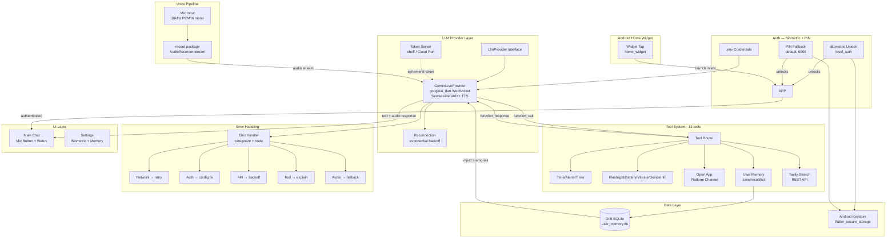

# J.A.R.V.I.S.

**AI Voice Assistant — Phase 1 Prototype**

A Flutter-based voice assistant for Android that combines Gemini Live's real-time audio API with 13 native device tools and persistent user memory. Tap the mic, speak a command, and J.A.R.V.I.S. responds with voice and text — setting alarms, searching the web, controlling device hardware, and remembering facts about you across sessions.

> **Target Device:** Google Pixel 7 — Android 17 (API 37)
> **Detailed Plan:** See [plans/jarvis-phase1-plan.md](plans/jarvis-phase1-plan.md) for full architecture, implementation phases, risk register, and design decisions.

---

## Features

### Voice Pipeline
- **Tap-to-Talk** — tap the mic button (or home screen widget) to start a conversation
- **Gemini Live WebSocket** — real-time bidirectional audio streaming at 16kHz PCM16 mono
- **Server-side VAD** — Gemini handles speech detection, barge-in, and turn-taking natively
- **TTS Playback** — Gemini generates audio responses, played back via `audioplayers` with PCM→WAV conversion

### Authentication
- **Biometric App-Lock** — fingerprint/face unlock via `local_auth`, with PIN fallback (default `0000`)
- **Secure Storage** — credentials and PIN stored in Android Keystore via `flutter_secure_storage`
- **No Server-Side Auth** — single-user prototype; all API credentials managed via `.env`

### Tools (13 total)
| Category | Tools |
|---|---|
| **Time & Scheduling** | `get_current_time`, `set_alarm`, `set_timer`, `cancel_alarm` |
| **Device Hardware** | `toggle_flashlight`, `get_battery_level`, `vibrate`, `get_device_info` |
| **App Control** | `open_app` (YouTube, Spotify, Chrome, Gmail, Maps, Camera, etc.) |
| **User Memory** | `save_memory`, `recall_memory`, `list_memories` |
| **Web Search** | `tavily_search` (real-time web results via Tavily API) |

### User Memory
- **Persistent across sessions** — facts, preferences, routines stored in Drift SQLite
- **Auto-injected into system prompt** — Gemini knows your preferences on every session
- **Structured categories** — preference, fact, schedule, contact, other

### Android Home Screen Widget
- Tap the widget to launch J.A.R.V.I.S. and start listening immediately
- Native Kotlin widget via `home_widget` package

### Error Handling
- **Structured taxonomy** — network, auth, API, tool, audio, data categories
- **Exponential backoff reconnection** — 1s→2s→4s→8s→16s→30s, max 5 retries
- **User-friendly messages** — clear, non-technical error descriptions

---

## Use Cases

| Use Case | Command Example | Tools Used |
|---|---|---|
| **Set an alarm** | "Wake me up at 7:30am" | `set_alarm` |
| **Web search** | "What's the latest on the Mars mission?" | `tavily_search` |
| **Remember preferences** | "Remember that I like dark roast coffee" | `save_memory` |
| **Recall stored facts** | "What coffee do I like?" | `recall_memory` |
| **Device control** | "Turn on the flashlight" / "What's my battery?" | `toggle_flashlight`, `get_battery_level` |
| **Launch apps** | "Open YouTube" / "Open Spotify" | `open_app` |
| **Check time** | "What time is it?" | `get_current_time` |
| **Set a timer** | "Set a timer for 5 minutes" | `set_timer` |
| **Device info** | "What phone is this?" | `get_device_info` |

---

## Tech Stack

| Layer | Technology | Purpose |
|---|---|---|
| **Framework** | Flutter 3.x / Dart 3.12+ | Cross-platform UI |
| **LLM** | [googleai_dart](https://pub.dev/packages/googleai_dart) ^8.0.0 | Gemini Live WebSocket API (`gemini-2.5-flash-native-audio-latest`) |
| **State Management** | [flutter_riverpod](https://pub.dev/packages/flutter_riverpod) ^2.6.0 | Compile-time safe DI + state |
| **Database** | [drift](https://pub.dev/packages/drift) ^2.22.0 | Type-safe SQLite for user memory |
| **Search** | [tavily_dart](https://pub.dev/packages/tavily_dart) ^0.2.4 | Web search REST API |
| **Audio Capture** | [record](https://pub.dev/packages/record) ^6.1.0 | Microphone → PCM16 stream |
| **Audio Playback** | [audioplayers](https://pub.dev/packages/audioplayers) ^6.1.0 | TTS response playback |
| **Auth** | [local_auth](https://pub.dev/packages/local_auth) ^2.3.0 | Biometric app-lock |
| **Secure Storage** | [flutter_secure_storage](https://pub.dev/packages/flutter_secure_storage) ^9.2.0 | PIN + preferences |
| **Alarms** | [alarm](https://pub.dev/packages/alarm) ^5.5.0 | In-app alarm scheduling |
| **Notifications** | [flutter_local_notifications](https://pub.dev/packages/flutter_local_notifications) ^18.0.0 | Timer notifications |
| **Home Widget** | [home_widget](https://pub.dev/packages/home_widget) ^0.9.3 | Android home screen widget |
| **Device APIs** | battery_plus, device_info_plus, vibration, flutter_system_action | Hardware control |
| **Backend** | Dart [shelf](https://pub.dev/packages/shelf) ^1.4.0 | Ephemeral token server |
| **Config** | [flutter_dotenv](https://pub.dev/packages/flutter_dotenv) ^5.2.0 | Environment variable loading |
| **Observability** | [logging](https://pub.dev/packages/logging) ^1.3.0 | Structured logging |

---

## Architecture



### Data Flow

1. **User taps mic** → `AudioPipeline` starts `record` stream (16kHz PCM16 mono)
2. **Audio frames** → streamed directly to `GeminiLiveProvider` WebSocket
3. **Gemini Live** processes audio with server-side VAD, detects speech, performs turn-taking
4. **Function calls** → emitted as `toolCallStream` → `ChatNotifier` routes to appropriate tool executor
5. **Tool results** → sent back as `function_response` → Gemini incorporates into final response
6. **TTS audio** → received as PCM via `audioStream` → buffered → converted to WAV → played via `audioplayers`
7. **User memories** → loaded from Drift SQLite on session connect → injected into Gemini system instruction

---

## Infrastructure

### Client (Android APK)
- **Platform:** Android 17 (API 37), Pixel 7 only for Phase 1
- **Build:** Flutter `flutter build apk`
- **Credentials:** `.env` bundled in APK assets (development) OR ephemeral tokens from backend (production)

### Backend — Ephemeral Token Server
A lightweight Dart [shelf](https://pub.dev/packages/shelf) server that keeps the real Gemini API key off the client device.

```
┌──────────────┐     POST /api/token      ┌──────────────────┐     Auth Token API     ┌──────────────┐
│  Flutter App  │─────────────────────────▶│  Token Server     │───────────────────────▶│  Gemini API   │
│  (APK)        │◀─────────────────────────│  (shelf/Dart)     │◀───────────────────────│  (Cloud)      │
└──────────────┘   { token: "xyz..." }    └──────────────────┘   ephemeral token       └──────────────┘
                                                  │
                                                  │ Holds real GEMINI_API_KEY
                                                  │ Validates TOKEN_SHARED_SECRET
                                                  ▼
                                          ┌──────────────────┐
                                          │  Cloud Run / VPS  │
                                          └──────────────────┘
```

| Endpoint | Method | Auth | Response |
|---|---|---|---|
| `/health` | GET | None | `200 OK` |
| `/api/token` | POST | `Authorization: Bearer <TOKEN_SHARED_SECRET>` | `{ "token": "...", "expiresAt": "ISO8601", "model": "..." }` |

**Deployment options:**
- **Google Cloud Run** — serverless, auto-scaling, free tier eligible
- **VPS / VPS** — any host running Dart (e.g., DigitalOcean, Hetzner)
- **Local** — `cd backend && dart run bin/server.dart` for development

**Auth modes:**
| Mode | Config | Use Case |
|---|---|---|
| **Direct API Key** | Set `GEMINI_API_KEY` in `.env` | Local development only |
| **Ephemeral Tokens** | Set `GEMINI_TOKEN_ENDPOINT` + `TOKEN_SHARED_SECRET` in `.env` | Production — real key never leaves server |

---

## Getting Started

### Prerequisites
- Flutter SDK 3.12+
- Android SDK (API 37)
- Google AI Studio API key ([aistudio.google.com](https://aistudio.google.com))
- Tavily API key ([tavily.com](https://tavily.com)) — optional, for web search

### Quick Start

```bash
# 1. Clone and setup
git clone <repo-url> && cd JARVIS

# 2. Install dependencies
flutter pub get

# 3. Configure credentials
cp .env.example .env
# Edit .env — add your GEMINI_API_KEY and TAVILY_API_KEY

# 4. Generate Drift database code
dart run build_runner build

# 5. Run on device
flutter run
```

### Backend Setup (Optional — for production token security)

```bash
cd backend
dart pub get

# Set environment variables
export GEMINI_API_KEY="your-real-key"
export TOKEN_SHARED_SECRET="your-shared-secret"
export GEMINI_MODEL_ID="gemini-2.5-flash-native-audio-latest"

# Run locally
dart run bin/server.dart
```

Then update the app's `.env` to use ephemeral tokens:
```env
GEMINI_TOKEN_ENDPOINT=http://<server-ip>:8080/api/token
TOKEN_SHARED_SECRET=your-shared-secret
# Leave GEMINI_API_KEY empty — token server handles it
```

---

## Project Structure

```
JARVIS/
├── lib/
│   ├── main.dart                          # App entry point, theme, auth gate
│   ├── config/
│   │   └── llm_config.dart                # LLM config from .env (model, temp, voice, auth mode)
│   ├── data/
│   │   └── database.dart                  # Drift SQLite — UserMemories table
│   ├── providers/
│   │   ├── auth_provider.dart             # Biometric + PIN auth state
│   │   ├── chat_provider.dart             # Session orchestration, tool routing, audio playback
│   │   ├── config_provider.dart           # LlmConfig Riverpod provider
│   │   ├── database_provider.dart         # AppDatabase singleton
│   │   ├── llm_provider.dart              # LlmProvider abstract interface + types
│   │   ├── llm_provider_provider.dart     # Provider selection (Gemini for Phase 1)
│   │   └── memory_provider.dart           # System instruction builder with injected memories
│   ├── services/
│   │   ├── audio_pipeline.dart            # Mic → Gemini Live audio streaming
│   │   ├── auth_service.dart              # Biometric + PIN via local_auth + secure_storage
│   │   ├── error_handler.dart             # Error categorization and user-facing messages
│   │   └── gemini_live_provider.dart      # Gemini Live WebSocket implementation
│   ├── tools/
│   │   ├── tool_registry.dart             # ToolDefinition + canonical registry (13 tools)
│   │   ├── memory_tools.dart              # save_memory, recall_memory, list_memories
│   │   ├── native_tools.dart              # Time, alarm, timer, flashlight, battery, vibrate, device info, open app
│   │   └── tavily_tool.dart               # Tavily web search
│   └── ui/
│       ├── screens/
│       │   ├── auth_screen.dart           # Biometric prompt screen
│       │   └── home_screen.dart           # Main chat UI + settings
│       └── widgets/                       # Reusable UI widgets
├── backend/
│   ├── pubspec.yaml                       # shelf + googleai_dart
│   └── bin/
│       └── server.dart                    # Ephemeral token server
├── assets/                                # App assets (alarm sounds, etc.)
├── plans/
│   └── jarvis-phase1-plan.md              # Full architecture & implementation plan
├── .env.example                           # Documented environment variable template
├── pubspec.yaml                           # Flutter dependencies
└── README.md                              # This file
```

---

## Configuration Reference

| Variable | Required | Default | Description |
|---|---|---|---|
| `GEMINI_MODEL_ID` | Yes | `gemini-2.5-flash-native-audio-latest` | Gemini model for Live API |
| `GEMINI_TEMPERATURE` | No | `0.7` | Response creativity (0.0–1.0) |
| `GEMINI_VOICE` | No | `Puck` | TTS voice (Puck, Charon, Kore, Fenrir, Aoede) |
| `GEMINI_API_KEY` | Dev only | — | Direct API key (never ship to production) |
| `GEMINI_TOKEN_ENDPOINT` | Prod only | — | URL of ephemeral token server |
| `TOKEN_SHARED_SECRET` | Prod only | — | Shared secret for token server auth |
| `TAVILY_API_KEY` | No | — | Tavily search API key |

---

## Phase 1 Scope

**Included:** Tap-to-talk voice pipeline, biometric + PIN auth, 13 tools (time, alarms, device control, app launch, web search, user memory), home screen widget, structured error handling, ephemeral token backend.

**Deferred to Phase 2+:** Wake word detection, Google Calendar/Gmail integration, multi-device support, foreground service (always-listening), offline TTS, multi-user Firebase auth, SMS/Phone tools, location services.

See [plans/jarvis-phase1-plan.md](plans/jarvis-phase1-plan.md) for the complete scope, exclusions, risk register, and implementation timeline.

---

## License

Proprietary — Phase 1 Prototype
