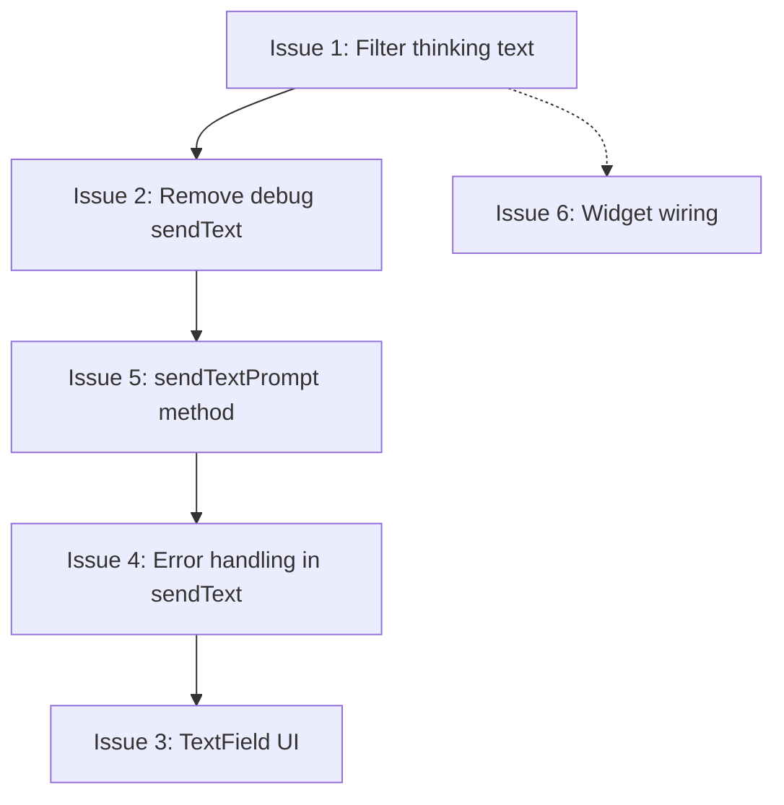

# JARVIS — 6-Issue Fix Plan (Corrected)

> **Review Status:** All 6 issues confirmed in codebase. Corrections applied where the original analysis had package name / resource mismatches.

---

## Issue 1: 🧠 Filter Model Thinking/Reasoning Text

| Field | Detail |
|-------|--------|
| **Files** | `lib/services/gemini_live_provider.dart` + `pubspec.yaml` |
| **Severity** | 🔴 High |

**Root cause:** At [`gemini_live_provider.dart:227-229`](../lib/services/gemini_live_provider.dart:227), the `_handleServerMessage` method processes `BidiGenerateContentServerContent` and streams **all** `TextPart` content — including parts where `thought == true` (internal reasoning).

**Fix — Part A: Filter in `gemini_live_provider.dart`**

In `_handleServerMessage`, inside the `BidiGenerateContentServerContent` case, change lines 227-229 from:

```dart
if (part is gai.TextPart && part.text.isNotEmpty) {
  _log.info('Gemini text: "..."');
  _textStreamController.add(part.text);
}
```

To:

```dart
if (part is gai.TextPart && part.text.isNotEmpty) {
  if (part.thought == true) {
    _log.fine('Skipping thought: "${part.text.substring(0, math.min(50, part.text.length))}..."');
    continue;
  }
  _log.info('Gemini text: "${part.text.length > 80 ? '${part.text.substring(0, 80)}...' : part.text}"');
  _textStreamController.add(part.text);
}
```

**Fix — Part B: Upgrade `googleai_dart`**

The `thought` property on `TextPart` was introduced in v9.0.0. Update [`pubspec.yaml:18`](../pubspec.yaml:18):

```yaml
googleai_dart: ^9.0.0  # was ^8.0.0 — needed for TextPart.thought property
```

Then run `flutter pub get`.

**⚠️ Risk:** The v8→v9 upgrade may include other breaking changes. After `flutter pub get`, verify the project still compiles. If there are API changes beyond `TextPart.thought`, they'll need separate fixes.

---

## Issue 2: 🔧 Remove Debug `sendText('Hello')`

| Field | Detail |
|-------|--------|
| **File** | `lib/providers/chat_provider.dart` |
| **Severity** | 🟡 Medium |

**Root cause:** At [`chat_provider.dart:208-209`](../lib/providers/chat_provider.dart:208), inside `startSession()` after `connect()`:

```dart
// DEBUG: Send text query to verify pipeline works (mirrors integration test)
llmProvider.sendText('Hello');
```

**Fix:** Delete both lines (208-209). The pipeline is verified, this debug artifact is no longer needed.

---

## Issue 3: 💬 Add `sendTextPrompt()` — User Messages in Chat History

| Field | Detail |
|-------|--------|
| **File** | `lib/providers/chat_provider.dart` |
| **Severity** | 🟡 Medium |

**Root cause:** `ChatNotifier` has no method to send a text prompt that also creates a user `ChatMessage`. The existing `_addSystemMessage()` only creates system messages.

**Fix:** Add a `sendTextPrompt()` method to `ChatNotifier`. Insert it after `toggleListening()` (after line 282):

```dart
/// Send a text prompt and add it to chat history as a user message.
/// The model's response streams in via the existing _textSub listener
/// and is committed on turnComplete.
Future<void> sendTextPrompt(String text) async {
  // Add user message to chat history
  state = state.copyWith(
    messages: [
      ...state.messages,
      ChatMessage(
        text: text,
        isUser: true,
        timestamp: DateTime.now(),
      ),
    ],
    sessionState: ChatSessionState.thinking,
    currentResponse: '',
  );

  // Send to LLM
  final llmProvider = _ref.read(llmProviderProvider);
  llmProvider.sendText(text);

  // Response streams in via _textSub, committed by _turnCompleteSub → _commitResponse()
}
```

**Why this works:** The existing `_textSub` listener (line 149) appends text to `currentResponse`. The `_turnCompleteSub` listener (line 194) calls `_commitResponse()` which moves `currentResponse` into `state.messages` as a non-user message. No new stream wiring needed.

---

## Issue 4: 🛡️ Error Handling in `sendText()`

| Field | Detail |
|-------|--------|
| **File** | `lib/services/gemini_live_provider.dart` |
| **Severity** | 🟡 Medium |

**Root cause:** At [`gemini_live_provider.dart:303-306`](../lib/services/gemini_live_provider.dart:303):

```dart
@override
void sendText(String text) {
  _session?.sendText(text);  // ← no null check, no try-catch
}
```

**Fix:** Replace with:

```dart
@override
void sendText(String text) {
  if (_session == null) {
    _log.warning('sendText called but session is null — text not sent');
    return;
  }
  try {
    _session!.sendText(text);
  } catch (e, stack) {
    _log.severe('Failed to send text via WebSocket', e, stack);
  }
}
```

---

## Issue 5: ⌨️ Add Text Input UI

| Field | Detail |
|-------|--------|
| **File** | `lib/ui/screens/home_screen.dart` |
| **Severity** | 🟡 Medium |

**Root cause:** [`home_screen.dart`](lib/ui/screens/home_screen.dart) has only `_MicBar` for input — no `TextField`.

**Fix:** Three changes to `home_screen.dart`:

**A)** Add a `TextEditingController` field to `_HomeScreenState` (line 20):

```dart
final _textController = TextEditingController();
```

**B)** Add `dispose` override:

```dart
@override
void dispose() {
  _textController.dispose();
  _scrollController.dispose();
  super.dispose();
}
```

**C)** Replace the `_MicBar(...)` in the body `Column` (lines 78-81) with a combined input bar. The cleanest approach: wrap both in a `Column` or modify `_MicBar` to include the text field. Recommended: create a new `_InputBar` widget that contains both:

Replace lines 77-82:
```dart
// Bottom mic bar
_MicBar(
  state: chatData.sessionState,
  onTap: chat.toggleListening,
),
```

With a new `_InputBar` widget. Add this class before `_MicBar`:

```dart
class _InputBar extends StatelessWidget {
  final ChatSessionState state;
  final VoidCallback onMicTap;
  final TextEditingController textController;
  final Function(String) onSendText;

  const _InputBar({
    required this.state,
    required this.onMicTap,
    required this.textController,
    required this.onSendText,
  });

  @override
  Widget build(BuildContext context) {
    final theme = Theme.of(context);
    final isListening = state == ChatSessionState.listening;

    return Container(
      padding: const EdgeInsets.symmetric(horizontal: 12, vertical: 8),
      decoration: BoxDecoration(
        color: theme.colorScheme.surface,
        border: Border(
          top: BorderSide(
            color: theme.colorScheme.outlineVariant.withAlpha(80),
          ),
        ),
      ),
      child: Row(
        children: [
          // Text input
          Expanded(
            child: TextField(
              controller: textController,
              style: theme.textTheme.bodyMedium,
              decoration: InputDecoration(
                hintText: 'Type a message...',
                hintStyle: theme.textTheme.bodyMedium?.copyWith(
                  color: theme.colorScheme.onSurfaceVariant.withAlpha(100),
                ),
                filled: true,
                fillColor: theme.colorScheme.surfaceContainerHighest.withAlpha(60),
                contentPadding: const EdgeInsets.symmetric(horizontal: 16, vertical: 10),
                border: OutlineInputBorder(
                  borderRadius: BorderRadius.circular(24),
                  borderSide: BorderSide.none,
                ),
              ),
              onSubmitted: (text) {
                final trimmed = text.trim();
                if (trimmed.isNotEmpty) {
                  onSendText(trimmed);
                  textController.clear();
                }
              },
            ),
          ),
          const SizedBox(width: 8),
          // Send button (visible when text is present)
          // Mic button
          _MicButton(state: state, onTap: onMicTap),
        ],
      ),
    );
  }
}
```

Then replace `_MicBar` usage at line 78 with:

```dart
_InputBar(
  state: chatData.sessionState,
  onMicTap: chat.toggleListening,
  textController: _textController,
  onSendText: (text) {
    ref.read(chatProvider.notifier).sendTextPrompt(text);
  },
),
```

**Note:** The existing `_MicBar` widget can remain as-is for now, or be refactored into the `_MicButton` used inside `_InputBar`. The simplest approach: extract just the mic button circle into a private `_MicButton` widget and keep `_MicBar` unchanged (it won't be used anymore but won't hurt).

---

## Issue 6: 📱 Wire Up Android Home Screen Widget

| Field | Detail |
|-------|--------|
| **Files** | New: `JarvisWidgetProvider.kt`, `widget_info.xml`, `widget_layout.xml`<br>Edit: `AndroidManifest.xml`, `lib/main.dart` |
| **Severity** | 🟢 Low |

**Root cause:** `home_widget: ^0.9.3` is declared in `pubspec.yaml` but never integrated — missing Android provider, manifest entry, XML resources, and Dart calls.

### ⚠️ Corrections vs. Original Plan

| Original | Corrected | Reason |
|----------|-----------|--------|
| `com.example.jarvis` | `com.jarvis.jarvis` | Actual package from [`MainActivity.kt:1`](../android/app/src/main/kotlin/com/jarvis/jarvis/MainActivity.kt:1) |
| `@drawable/widget_background` | Omit or create file | No such drawable exists in `res/drawable/` |

### Fix — Part A: Kotlin Provider

Create `android/app/src/main/kotlin/com/jarvis/jarvis/JarvisWidgetProvider.kt`:

```kotlin
package com.jarvis.jarvis

import es.antonborri.home_widget.HomeWidgetProvider

class JarvisWidgetProvider : HomeWidgetProvider()
```

### Fix — Part B: AndroidManifest.xml

Add inside `<application>` (after the `</activity>` closing tag, before `<!-- Flutter embedding -->` at line 42):

```xml
<!-- Home Screen Widget -->
<receiver
    android:name=".JarvisWidgetProvider"
    android:exported="false">
    <intent-filter>
        <action android:name="android.appwidget.action.APPWIDGET_UPDATE" />
    </intent-filter>
    <meta-data
        android:name="android.appwidget.provider"
        android:resource="@xml/widget_info" />
</receiver>
```

### Fix — Part C: Widget XML Resources

Create `android/app/src/main/res/xml/widget_info.xml`:

```xml
<?xml version="1.0" encoding="utf-8"?>
<appwidget-provider xmlns:android="http://schemas.android.com/apk/res/android"
    android:minWidth="110dp"
    android:minHeight="110dp"
    android:updatePeriodMillis="0"
    android:initialLayout="@layout/widget_layout"
    android:resizeMode="none"
    android:widgetCategory="home_screen" />
```

Create `android/app/src/main/res/layout/widget_layout.xml`:

```xml
<?xml version="1.0" encoding="utf-8"?>
<RelativeLayout xmlns:android="http://schemas.android.com/apk/res/android"
    android:layout_width="match_parent"
    android:layout_height="match_parent"
    android:background="#FF1A1A2E"
    android:padding="12dp">

    <ImageView
        android:id="@+id/widget_icon"
        android:layout_width="48dp"
        android:layout_height="48dp"
        android:layout_centerHorizontal="true"
        android:src="@mipmap/ic_launcher"
        android:contentDescription="J.A.R.V.I.S." />

    <TextView
        android:id="@+id/widget_status"
        android:layout_width="wrap_content"
        android:layout_height="wrap_content"
        android:layout_below="@id/widget_icon"
        android:layout_centerHorizontal="true"
        android:layout_marginTop="8dp"
        android:text="Tap to speak"
        android:textColor="#FF00BCD4"
        android:textSize="12sp" />
</RelativeLayout>
```

> **Note:** Changed `@drawable/widget_background` to a hardcoded dark blue `#FF1A1A2E` to match the app's dark theme. No separate drawable file needed.

### Fix — Part D: Dart Integration

In [`lib/main.dart`](../lib/main.dart), add the import and call `HomeWidget` methods. The best place: add a listener in `chat_provider.dart` that pushes widget data when session state changes, or add it to `main.dart`'s `JarvisApp.build()`.

**Option A (simpler — in `main.dart`):** Add import and initial registration:

```dart
import 'package:home_widget/home_widget.dart';
```

In `JarvisApp.build()`, before the `return MaterialApp(...)`:

```dart
// Register home screen widget (background update)
HomeWidget.setAppGroupId('com.jarvis.jarvis');
```

**Option B (reactive — in `chat_provider.dart`):** Push widget data when session state changes, so the widget shows current status. Add to `startSession()` after state is set to `listening`:

```dart
HomeWidget.saveWidgetData('widget_status', 'listening');
HomeWidget.updateWidget(androidName: 'JarvisWidgetProvider');
```

Add to `endSession()` and `stopListening()`:

```dart
HomeWidget.saveWidgetData('widget_status', 'idle');
HomeWidget.updateWidget(androidName: 'JarvisWidgetProvider');
```

**Recommendation:** Use Option A for initial wiring (simpler). Option B can be layered on later for a dynamic widget status indicator.

---

## 📋 Execution Order

```
1 → 2 → 5 → 4 → 3 → 6
```

| Step | Issue | Rationale |
|------|-------|-----------|
| 1 | Filter thinking text | Most visible UX bug; requires dependency upgrade |
| 2 | Remove debug sendText | Cleanup before adding real text input |
| 5 | sendTextPrompt() | Needed by text input UI (Issue 3) |
| 4 | Error handling in sendText | Called by sendTextPrompt(); add guards first |
| 3 | TextField UI | Depends on sendTextPrompt() (Issue 5) |
| 6 | Widget wiring | Standalone feature, no dependencies on 1–5 |

## Key Dependencies Between Issues


