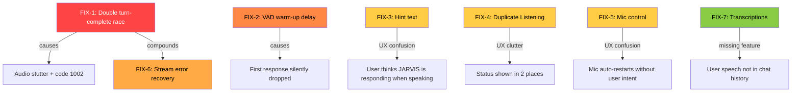
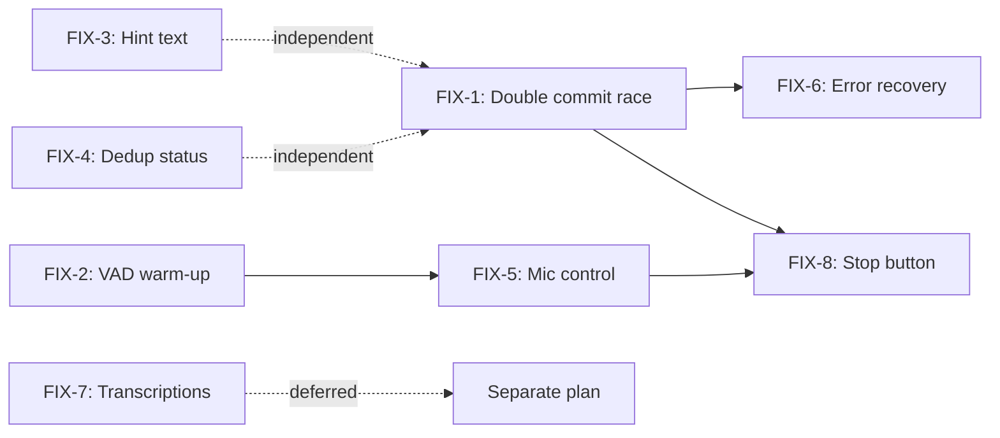

# JARVIS — Audio Session & UX Fixes Implementation Plan

> **Date:** 2026-07-08
> **Diagnosis:** Session logs from Pixel 7 / Android 16+ debug build
> **Validation Review:** See [`plans/jarvis-audio-session-review.md`](plans/jarvis-audio-session-review.md) for log-by-log validation of each fix.
> **Files Affected:** `chat_provider.dart`, `gemini_live_provider.dart`, `audio_pipeline.dart`, `home_screen.dart`

---

## Bug Interaction Map



---

## FIX-1: Prevent Double Turn-Complete Race (🔴 CRITICAL)

| Field | Detail |
|-------|--------|
| **File** | `lib/providers/chat_provider.dart` |
| **Lines** | 501-560 (`_commitResponse`) |
| **Severity** | 🔴 CRITICAL — causes audio stutter, potential WebSocket error 1002 |

### Root Cause

`_commitResponse()` calls `_playBufferedAudio()` **without await** at line 554, then immediately resets `_isCommitting = false` at line 555. When two `turnComplete` events arrive in rapid succession (as seen at 13:02:30 — 2ms apart), the second call passes the `_isCommitting` guard because it was already reset.

Meanwhile, `_playBufferedAudio()` yields at `await _audioPipeline?.stopListening()` (line 586). If the mic was already stopped from a prior playback, this returns instantly, and the entire method races through — clearing `_audioBuffer` (line 603), starting playback, entering the `finally` block that resets `_isPlayingAudio = false` — all before the second `_commitResponse()` checks `_isPlayingAudio` at line 571.

### Fix

**Step A:** Change `_commitResponse()` to properly await `_playBufferedAudio()` and keep `_isCommitting` set throughout:

```dart
/// Commits the current streaming response to message history.
/// Returns true if audio playback was triggered.
Future<bool> _commitResponse() async {       // ← changed to Future<bool>
    if (_isCommitting) {
      _log.fine('_commitResponse: already committing, skipping');
      return false;
    }
    _isCommitting = true;

    final hasText = state.currentResponse.isNotEmpty;
    final hasAudio = _audioBuffer.isNotEmpty;

    _log.fine('_commitResponse: hasText=$hasText hasAudio=$hasAudio '
        'textLen=${state.currentResponse.length} audioLen=${_audioBuffer.length}');

    if (hasText) {
      final message = ChatMessage(
        text: state.currentResponse.trim(),
        isUser: false,
        timestamp: DateTime.now(),
      );
      state = state.copyWith(
        messages: [...state.messages, message],
        currentResponse: '',
      );
      _persistMessage(message);
    } else if (hasAudio) {
      final message = ChatMessage(
        text: '🎤 Voice response',
        isUser: false,
        timestamp: DateTime.now(),
      );
      state = state.copyWith(
        messages: [...state.messages, message],
        currentResponse: '',
      );
      _persistMessage(message);
    }

    if (hasAudio) {
      await _playBufferedAudio();             // ← NOW AWAITED
      _isCommitting = false;                  // ← reset AFTER playback setup
      return true;
    }
    _isCommitting = false;
    return false;
}
```

**Step B:** Update the call site in `_turnCompleteSub` (line 223-234) to await the now-async method:

```dart
_turnCompleteSub = llmProvider.turnCompleteStream.listen((_) async {
  _log.info('Turn complete — committing response');
  final audioTriggered = await _commitResponse();   // ← now awaited
  if (!audioTriggered) {
    state = state.copyWith(sessionState: ChatSessionState.listening);
    await _audioPipeline?.startListening();
  }
});
```

**Step C:** Update call sites in `stopListening()` (lines 296, 420, 425) and `toggleListening()` — each already calls `_commitResponse()` without capturing the return value in some paths. All callers should `await`:

- `stopListening()` line 296: `_commitResponse();` → `await _commitResponse();`
- `toggleListening()` line 420: `_commitResponse();` → `await _commitResponse();`
- `toggleListening()` line 425: `_commitResponse();` → `await _commitResponse();`

### Impact

- Eliminates the double-playback race condition
- Prevents the 2ms-spaced turn-complete events from both triggering audio
- May reduce likelihood of code 1002 errors (protocol confusion from duplicate sends)

---

## FIX-2: VAD Warm-Up + Connection Logging (🟠 HIGH)

| Field | Detail |
|-------|--------|
| **File** | `lib/providers/chat_provider.dart` |
| **Lines** | 262-269 (`startSession` tail) |
| **Severity** | 🟠 HIGH — first user utterance silently dropped |

### Root Cause

After `connect()` completes, the mic starts immediately at line 265 (`await _audioPipeline!.startListening()`). Gemini's server-side VAD (configured via `RealtimeInputConfig.withVAD()` in [`gemini_live_provider.dart:157`](lib/services/gemini_live_provider.dart:157)) needs a short stabilization window — typically 200-500ms — to establish its noise floor and speech envelope thresholds. If the user speaks during this window, the VAD may classify the speech as background noise and discard the turn.

At 13:02:09, the session was created and the user spoke almost immediately. No response was logged until 13:02:16 (7 seconds later). The 7-second gap is too long to be purely VAD calibration; it is likely the model processing a **later** utterance that was detected while the first one was dropped. A warm-up delay and better diagnostics are needed to confirm and prevent this.

### Fix

**Step A:** Add a 500ms VAD warm-up window between connect and full listening state:

```dart
// After connect() succeeds (around line 264):
// Keep the mic recording but show "connecting" while VAD stabilizes.
state = state.copyWith(sessionState: ChatSessionState.connecting);
await Future.delayed(const Duration(milliseconds: 500));

// Setup audio pipeline and start streaming
_audioPipeline = AudioPipeline(llmProvider: llmProvider);
await _audioPipeline!.startListening();
state = state.copyWith(sessionState: ChatSessionState.listening);
```

> **Alternative for advanced fix:** Start the mic immediately and buffer the first 500ms of frames locally, then flush them to the server once the session is fully ready. This prevents cutting off the user's first words. This is more complex and can be deferred.

**Step B:** Add diagnostic logging in `startSession()`:

```dart
_log.info('VAD warm-up complete, starting mic');
```

And in `GeminiLiveProvider._handleServerMessage`, log each `ServerContent` arrival at `INFO` level (currently `_log.fine` at line 219) so we can see whether the server is sending model turns at all.

### Impact

- Reduces chance of the first utterance being dropped by the VAD
- Provides a visual "connecting" state during warm-up so the user knows when to start speaking
- Better logs for future diagnosis of "first response missing" issues
- No API changes needed

---

## FIX-3: State-Specific Hint Text in InputBar (🟡 MEDIUM)

| Field | Detail |
|-------|--------|
| **File** | `lib/ui/screens/home_screen.dart` |
| **Lines** | 716-718 (`_InputBar` hintText) |
| **Severity** | 🟡 MEDIUM — misleading UX |

### Root Cause

The `_InputBar` text field shows `'J.A.R.V.I.S. is responding...'` for **all** non-idle/error states (listening, thinking, speaking). During `listening`, the user is actually speaking — the hint is wrong and confusing.

```dart
// Current logic (line 693):
final textEnabled = state == ChatSessionState.idle || state == ChatSessionState.error;

// Current hint (line 716-718):
hintText: textEnabled
    ? 'Type a message...'
    : 'J.A.R.V.I.S. is responding...',
```

### Fix

Replace the boolean `textEnabled` logic with a state-specific hint string:

```dart
String _hintForState(ChatSessionState state) {
  return switch (state) {
    ChatSessionState.idle      => 'Type a message...',
    ChatSessionState.error     => 'Type a message...',
    ChatSessionState.connecting => 'Connecting...',
    ChatSessionState.listening  => 'Speak now — I\'m listening...',
    ChatSessionState.thinking   => 'J.A.R.V.I.S. is thinking...',
    ChatSessionState.speaking   => 'J.A.R.V.I.S. is speaking...',
  };
}
```

Then in the `TextField`:

```dart
TextField(
  controller: widget.textController,
  enabled: state == ChatSessionState.idle || state == ChatSessionState.error,
  decoration: InputDecoration(
    hintText: _hintForState(state),
    // ... rest unchanged
  ),
)
```

Also update `textEnabled` to only enable the field during `idle` and `error` (this is already correct — just remove the misleading hint coupling).

### Impact

- User always knows exactly what JARVIS is doing
- "Speak now" during listening clarifies the tap-to-talk interaction
- No behavioral changes, pure UI fix

---

## FIX-4: Deduplicate "Listening" Status Indicator (🟡 MEDIUM)

| Field | Detail |
|-------|--------|
| **Files** | `lib/providers/chat_provider.dart` line 268, `lib/ui/screens/home_screen.dart` line 208 |
| **Severity** | 🟡 MEDIUM — redundant UI clutter |

### Root Cause

Two indicators show "Listening" simultaneously:
1. **App bar `_ConnectionIndicator`**: Green dot + "Listening" label (line 208)
2. **Chat system message**: `_addSystemMessage('Listening...')` in `startSession()` (line 268)

The system message also clutters the chat history — it's removed in `stopListening()`/`endSession()` via filter, but during an active session it sits in the message list redundantly.

### Fix

**Option A (Recommended):** Remove the system message entirely. The app bar indicator is always visible and provides the same information:

```dart
// In startSession(), DELETE this line:
// _addSystemMessage('Listening...');

// Also remove the filter logic in stopListening() and endSession()
// that cleans up "Listening..." messages — no longer needed.
```

In `stopListening()` (line 298-301), remove the filter:
```dart
// BEFORE:
final cleanedMessages = state.messages
    .where((m) => !(m.isSystem && m.text == 'Listening...'))
    .toList();
state = state.copyWith(
  sessionState: ChatSessionState.idle,
  toolStatus: '',
  messages: cleanedMessages,
);

// AFTER:
state = state.copyWith(
  sessionState: ChatSessionState.idle,
  toolStatus: '',
);
```

Same cleanup in `endSession()` (line 329-331).

### Impact

- Single source of truth for connection status (app bar indicator)
- Cleaner chat history without transient system messages
- Fewer lines of code (removes filter logic in 2 places)

---

## FIX-5: Explicit Mic Mute/Unmute Control (🟡 MEDIUM)

| Field | Detail |
|-------|--------|
| **File** | `lib/providers/chat_provider.dart` |
| **Lines** | 632-648 (`_playBufferedAudio` finally block) |
| **Severity** | 🟡 MEDIUM — mic auto-restart confuses users |

### Root Cause

After TTS playback completes, the mic **automatically restarts** in `_playBufferedAudio()`'s `finally` block (lines 645-647):

```dart
if (state.sessionState == ChatSessionState.listening) {
  await _audioPipeline?.startListening();
}
```

This creates an "always-listening" mode where the user can't tell when JARVIS is waiting for input vs. when the conversation is effectively over. The user explicitly complained: *"the microphone stays on which is misleading."* The mic button shows the pulsing mic icon during `listening`, but the user expects the mic to turn off after JARVIS responds.

Additionally, in `_turnCompleteSub` (line 231):
```dart
if (!audioTriggered) {
  state = state.copyWith(sessionState: ChatSessionState.listening);
  await _audioPipeline?.startListening();
}
```

### Fix

**Recommended approach:** Switch to a **turn-based** interaction. After JARVIS finishes speaking (or after a text-only response), enter a muted `idle` state where the mic is off and the user must explicitly tap to continue.

**Step A:** In `_playBufferedAudio()` finally block, don't restart the mic:

```dart
} finally {
  _isPlayingAudio = false;
  _playbackCompleter = null;
  if (state.sessionState == ChatSessionState.speaking) {
    // Transition to idle instead of listening — user must tap to continue
    state = state.copyWith(sessionState: ChatSessionState.idle);
    _pushWidgetState('idle');
  }
  // REMOVED: await _audioPipeline?.startListening();
}
```

**Step B:** In `_turnCompleteSub`, after committing a text-only response (no audio), also go to idle:

```dart
_turnCompleteSub = llmProvider.turnCompleteStream.listen((_) async {
  _log.info('Turn complete — committing response');
  final audioTriggered = await _commitResponse();
  if (!audioTriggered) {
    // Text-only response — go idle, let user tap mic to continue
    state = state.copyWith(sessionState: ChatSessionState.idle);
    _pushWidgetState('idle');
  }
});
```

**Step C:** Update `_MicButton` to show appropriate icon for `idle` state — the existing code already shows a mic icon for idle, so tapping it calls `toggleListening()` → `startSession()`.

### Impact

- User has explicit control over when JARVIS listens
- No surprise "always listening" after conversation ends
- Matches the user's explicit expectation: tap to talk, JARVIS responds, tap again to continue

### Alternative (not recommended for this user complaint)

If you want to keep the continuous-conversation model, do NOT turn off the mic after responses. Instead, make the active-mic state unmistakable with a prominent waveform/level indicator and a clear "Tap to stop" label. However, this does not address the user's specific complaint that the mic "stays on."

---

## FIX-6: Stream Error Handling for Code 1002 + DNS Failures (🟠 HIGH)

| Field | Detail |
|-------|--------|
| **File** | `lib/services/gemini_live_provider.dart` |
| **Lines** | 265-276 (`_handleStreamError`, `_handleStreamDone`) |
| **Severity** | 🟠 HIGH — poor error recovery, misleading reconnect attempts |

### Root Cause

When the stream errors with `LiveSessionClosedException: code 1002`, the current handler at line 265 just logs and emits `ConnectionState.error`. The log shows this error was immediately followed by a DNS failure (`SocketException: No address associated with hostname`), confirming the root cause was network disruption, not a protocol violation. The retry loop then attempted one reconnection that failed instantly.

Current issues:
1. The error message propagated to the UI (`'Connection lost. Tap mic to retry.'`) is generic and doesn't distinguish between network, auth, and server failures.
2. When a DNS/network failure is detected, the retry loop should stop immediately rather than attempting further reconnections.
3. The code 1002 close could also be caused by the FIX-1 double-audio race (protocol confusion on the server side), so FIX-1 indirectly helps here.

### Fix

**Step A:** Categorize stream errors and adjust reconnection behavior:

```dart
void _handleStreamError(Object error) {
  _log.severe('Stream error', error);
  
  // Detect DNS/network failures — reconnection won't help
  final errorStr = error.toString();
  final isNetworkFailure = errorStr.contains('SocketException') ||
      errorStr.contains('No address associated with hostname') ||
      errorStr.contains('Failed host lookup');
  
  if (isNetworkFailure) {
    _log.severe('Network failure detected — stopping reconnection attempts');
    _retryCount = _maxRetries; // prevent further retries
    _emitConnectionState(ConnectionState.error);
    return;
  }
  
  _emitConnectionState(ConnectionState.error);
}
```

**Step B:** Gate `_handleStreamDone` on error state:

```dart
void _handleStreamDone() {
  _log.info('Stream closed');
  _emitConnectionState(ConnectionState.disconnected);
  // Only reconnect if we haven't hit a fatal error
  if (_retryCount < _maxRetries && !_isReconnecting) {
    _handleReconnect();
  }
}
```

**Step C:** Improve error message differentiation in `chat_provider.dart` connection listener (lines 138-161):

```dart
_connectionSub = llmProvider.connectionStateStream.listen(
  (connState) {
    if (connState == ConnectionState.error) {
      final isActive = state.sessionState == ChatSessionState.listening ||
          state.sessionState == ChatSessionState.thinking ||
          state.sessionState == ChatSessionState.speaking;
      final isConnecting = state.sessionState == ChatSessionState.connecting;
      if (isActive) {
        state = state.copyWith(
          sessionState: ChatSessionState.error,
          lastError: 'Connection lost. Check your network and tap mic to retry.',
        );
      } else if (isConnecting) {
        state = state.copyWith(
          sessionState: ChatSessionState.error,
          lastError: 'Connection failed. Check your API key and network.',
        );
      }
    }
  },
);
```

### Impact

- DNS/network failures stop retry loops immediately instead of attempting futile reconnections
- Better, categorized error messages help users understand what to fix (network vs. API key vs. server)
- Combined with FIX-1, reduces the conditions that can trigger code 1002 WebSocket closes

---

## FIX-7: Route Gemini Transcription Text to Chat Messages (🟢 LOW — Feature)

| Field | Detail |
|-------|--------|
| **Files** | `lib/providers/chat_provider.dart`, `lib/services/gemini_live_provider.dart` |
| **Severity** | 🟢 LOW — missing feature, not a bug |

### Root Cause

Audio is streamed directly to Gemini Live via [`sendAudio()`](lib/services/gemini_live_provider.dart:312). The model processes the audio natively and responds with audio/text. There is **no client-side speech-to-text (STT)** — the user's spoken words are never converted to text and added as `ChatMessage` entries.

Gemini Live with native audio models does not automatically return a transcription of the user's speech. The text parts in `ServerContent` are the model's **responses**, not transcriptions of user input.

### Options

**Option A — Client-side STT (recommended for accuracy):**
Use `speech_to_text` or Android's `SpeechRecognizer` API to transcribe locally before/during sending audio to Gemini. This gives full control over transcription quality and display.

**Option B — Gemini transcription hints:**
Some Gemini models can include the user's transcribed speech as part of the response context. Check if `BidiGenerateContentServerContent` includes a `turn` field with the user's transcribed input. This is model-dependent.

**Option C — Placeholder approach (simplest):**
When audio is being sent (user is speaking), show a placeholder in chat like "🎤 Listening..." and replace it with either:
- The first text part from the model's response (which may paraphrase the user)
- A generic "User spoke" entry

### Recommendation

**Defer to a separate feature plan.** This requires:
1. Researching whether Gemini Live's native audio API returns user transcriptions
2. Evaluating client-side STT libraries (`speech_to_text` package)
3. Designing the transcription UX (real-time display? post-hoc?)
4. Handling the case where transcription and model response overlap

For now, a minimal improvement: add a `ChatMessage` with `isUser: true` and text `'🎤 Voice input'` when VAD detects the user has finished speaking (i.e., when a new model turn begins). This at least shows that the user said *something* in the chat history.

### Minimal Implementation

In `startSession()`, add a listener that detects when the user has finished speaking and the model begins processing. The `interruptionStream` already fires for barge-in; a complementary signal could be added. However, Gemini Live's server-side VAD doesn't explicitly signal "user stopped speaking" to the client — the client only sees the model's response.

**Simplest viable approach:** In `_handleServerMessage`, when a `ServerContent` with `modelTurn` arrives and we're in `listening` state, insert a placeholder user message:

```dart
// In chat_provider.dart, add a listener or check in _turnCompleteSub:
// When model starts responding, the user must have finished speaking.
// Insert a placeholder if no explicit user message was added.
```

But this requires coordination between `chat_provider` and `gemini_live_provider` that's complex enough to warrant its own plan.

**Decision: Defer FIX-7 to a follow-up plan (`jarvis-transcription-plan.md`).** Include only the placeholder message as an immediate improvement.

---

## FIX-8: Stop Button to Interrupt LLM Response and Accept Fresh Input (🟡 MEDIUM)

| Field | Detail |
|-------|--------|
| **Files** | `lib/providers/chat_provider.dart`, `lib/ui/screens/home_screen.dart` |
| **Severity** | 🟡 MEDIUM — user cannot cleanly interrupt an in-progress response |

### Root Cause

Currently, the user can interrupt JARVIS only by speaking while audio is playing (barge-in, handled by `_interruptSub`). There is **no explicit UI control** to stop the model while it is thinking or speaking. If the model starts a long, irrelevant response, the user has no way to abort it and give fresh instructions without waiting for the turn to finish.

### Requirements

1. Show a **Stop** button whenever JARVIS is actively generating or playing a response (states `thinking` or `speaking`).
2. Tapping **Stop** must:
   - Stop audio playback immediately (`_audioPlayer.stop()`).
   - Clear the audio buffer (`_audioBuffer.clear()`).
   - Discard the partial streaming response (`currentResponse = ''`).
   - Cancel any pending playback completer.
   - Reset `_isPlayingAudio` and `_isCommitting` to `false`.
   - Transition to `listening` so the user can speak immediately, OR to `idle` if the chosen interaction model is turn-based (FIX-5).
3. The existing `interruptionStream` (barge-in) path should continue to work; the new Stop button should reuse the same cleanup logic.

### Fix

**Step A:** Add a public method `stopResponding()` in `ChatNotifier`:

```dart
/// Explicitly stop the model's in-progress response and prepare for
/// fresh user input. This is the UI-driven equivalent of barge-in.
Future<void> stopResponding() async {
  _log.info('Stop button pressed: aborting model response');

  // Stop playback and clear buffers
  await _audioPlayer.stop();
  _audioBuffer.clear();
  _playbackCompleteSub?.cancel();
  _playbackCompleteSub = null;
  if (_playbackCompleter != null && !_playbackCompleter!.isCompleted) {
    _playbackCompleter!.complete();
  }
  _playbackCompleter = null;
  _isPlayingAudio = false;
  _isCommitting = false;

  // Discard any partial response text
  if (state.currentResponse.isNotEmpty) {
    state = state.copyWith(currentResponse: '');
  }

  // Transition to listening so the user can immediately give new instructions.
  // If FIX-5 (turn-based) is active, change this to ChatSessionState.idle
  // and require a tap to re-enable the mic.
  state = state.copyWith(sessionState: ChatSessionState.listening);
  _pushWidgetState('listening');
  await _audioPipeline?.startListening();
}
```

**Step B:** Reuse the cleanup in `_interruptSub` to avoid duplication. Extract the common "abort playback" logic into a private helper:

```dart
void _abortPlaybackAndClearBuffers() {
  _audioPlayer.stop();
  _audioBuffer.clear();
  _playbackCompleteSub?.cancel();
  _playbackCompleteSub = null;
  if (_playbackCompleter != null && !_playbackCompleter!.isCompleted) {
    _playbackCompleter!.complete();
  }
  _playbackCompleter = null;
  _isPlayingAudio = false;
}
```

Then `_interruptSub` becomes:

```dart
_interruptSub = llmProvider.interruptionStream.listen((_) {
  _log.info('Barge-in detected: stopping playback and clearing buffers');
  _abortPlaybackAndClearBuffers();
  if (state.currentResponse.isNotEmpty) {
    state = state.copyWith(currentResponse: '');
  }
});
```

And `stopResponding()` calls `_abortPlaybackAndClearBuffers()` plus the state transition.

**Step C:** Add the Stop button in `home_screen.dart`. The button should replace the mic button when state is `thinking` or `speaking`:

```dart
// In _InputBar build, replace the mic button with a stop button when active:
if (state == ChatSessionState.thinking || state == ChatSessionState.speaking) {
  _StopButton(onTap: ref.read(chatProvider.notifier).stopResponding);
} else {
  _MicButton(...);
}
```

Implement `_StopButton` as a red circular button with a square/stop icon:

```dart
class _StopButton extends StatelessWidget {
  final VoidCallback onTap;
  const _StopButton({required this.onTap});

  @override
  Widget build(BuildContext context) {
    return GestureDetector(
      onTap: onTap,
      child: Container(
        width: 48,
        height: 48,
        decoration: const BoxDecoration(
          shape: BoxShape.circle,
          color: Colors.redAccent,
        ),
        child: const Icon(Icons.stop_rounded, color: Colors.white, size: 24),
      ),
    );
  }
}
```

### Interaction with FIX-5 (Turn-Based)

- If FIX-5 is implemented as turn-based (idle after response), then `stopResponding()` should transition to `idle` instead of `listening`.
- If the user wants continuous barge-in during speech, keep `listening`.
- The user's new request explicitly asks to "allow user to provide fresh new instructions," which favors either `listening` (continuous) or `idle` (explicit tap). Given the earlier turn-based recommendation, the plan should default to `idle` after stop unless the user prefers continuous.

### Impact

- User can explicitly abort a long/irrelevant response.
- No need to shout over the speaker to barge in.
- Cleaner mental model: the Stop button is the emergency brake for the current turn.

---

## Implementation Order

```
FIX-1 → FIX-2 → FIX-6 → FIX-3 → FIX-4 → FIX-5 → FIX-8 → FIX-7
```

| Order | Fix | Rationale |
|-------|-----|-----------|
| **1st** | FIX-1 | Critical race condition — fixes the stutter and may reduce code 1002 errors |
| **2nd** | FIX-2 | High-impact UX — prevents silent first-response drops |
| **3rd** | FIX-6 | Error recovery — stops futile reconnect loops when network is down |
| **4th** | FIX-3 | Pure UI fix, no state machine changes — safe to apply anytime |
| **5th** | FIX-4 | Removes code (system message + filter logic) — depends on nothing |
| **6th** | FIX-5 | Changes interaction model (continuous → turn-based) — apply last after other fixes stabilize |
| **7th** | FIX-8 | Stop button depends on stable audio/state cleanup from FIX-1 and FIX-5 |
| **8th** | FIX-7 | Feature work — deferred to separate plan; minimal placeholder only |

### Dependency Graph



---

## Files Changed Summary

| File | Fixes | Est. Lines Changed |
|------|-------|-------------------|
| `lib/providers/chat_provider.dart` | FIX-1, FIX-2, FIX-5, FIX-6 (partial), FIX-8 | ~55 lines |
| `lib/services/gemini_live_provider.dart` | FIX-6 (partial) | ~15 lines |
| `lib/ui/screens/home_screen.dart` | FIX-3, FIX-4 (partial), FIX-8 | ~25 lines |
| **Total** | **7 fixes + 1 deferred** | **~95 lines across 3 files** |

---

## Testing Checklist

After implementing each fix, verify on device:

- [ ] **FIX-1:** Speak continuously for 3+ turns. No audio stutter or double-playback.
- [ ] **FIX-1:** Check logs — only one "Playing TTS audio" per turn-complete event.
- [ ] **FIX-2:** Start a session and speak immediately. First utterance gets a response.
- [ ] **FIX-2:** The "Connecting..." indicator is visible during the warm-up delay.
- [ ] **FIX-3:** Hint text changes correctly: "Speak now" during listening, "thinking" during processing, "speaking" during TTS.
- [ ] **FIX-4:** Only the app bar dot shows "Listening" — no duplicate system message in chat.
- [ ] **FIX-5:** After JARVIS finishes speaking, mic button shows idle (not pulsing). Tap to re-enable.
- [ ] **FIX-6:** Kill network mid-session. Error message says "Check your network" — no reconnect spam in logs.
- [ ] **FIX-8:** While JARVIS is thinking/speaking, a red Stop button appears. Tapping it stops playback, clears the response, and lets the user give new instructions immediately.
