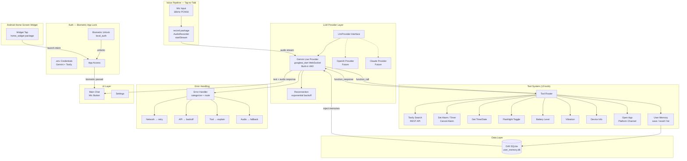

# J.A.R.V.I.S. — Phase 1 Prototype Plan

**Status:** Ready for Implementation
**Target Platform:** Android (Flutter)
**Target Device:** Google Pixel 7 — Android 17 (API 37)
**Last Updated:** 2026-07-05
**Scope:** Minimal viable voice assistant — Gemini Live + Tavily + Native Android functions
**Base Model:** `gemini-3.1-flash-live-preview` (configurable via `.env`)

---

## Table of Contents

1. [Phase 1 Scope & Exclusions](#1-phase-1-scope--exclusions)
2. [Architecture Overview](#2-architecture-overview)
   - 2.1 [Credential Management](#21-credential-management)
   - 2.2 [Voice Pipeline Architecture — Tap-to-Talk + Gemini Live VAD](#22-voice-pipeline-architecture--tap-to-talk--gemini-live-vad)
   - 2.3 [Android Home Screen Widget](#23-android-home-screen-widget)
3. [Authentication — Biometric App Lock](#3-authentication--biometric-app-lock)
4. [LLM Provider Abstraction](#4-llm-provider-abstraction)
   - 4.1 [Reconnection Strategy](#41-reconnection-strategy)
   - 4.2 [Error Taxonomy](#42-error-taxonomy)
5. [Tool System — Native Android + Tavily](#5-tool-system--native-android--tavily)
6. [Native Android Use Case Catalog](#6-native-android-use-case-catalog)
7. [Tavily Integration Strategy](#7-tavily-integration-strategy)
8. [Implementation Phases](#8-implementation-phases)
9. [Updated Library Manifest](#9-updated-library-manifest)
10. [Risk Register](#10-risk-register)
11. [Mermaid Diagram](#11-mermaid-diagram)

---

## 1. Phase 1 Scope & Exclusions

### Target Device

| Device | OS | API Level | Notes |
|---|---|---|---|
| **Google Pixel 7** | Android 17 | 37 | Stock Android, full Google Play Services |

> **`minSdkVersion: 37`** — targeting only Android 17 eliminates all legacy permission workarounds and OEM compatibility concerns. Multi-device support (Samsung, de-googled ROMs, etc.) is deferred to Phase 2+.

### ✅ Included in Phase 1

| Feature | Detail |
|---|---|
| **Voice Pipeline** | Tap-to-talk (mic button / widget) → Gemini Live WebSocket with server-side VAD |
| **Android Widget** | Home screen widget (via `home_widget` package). Tap to launch JARVIS and start listening. |
| **Auth — Biometric** | Fingerprint/Face unlock via `local_auth` as simple app-lock (no server-side auth) |
| **LLM — Gemini** | Gemini Live API (text + audio, function calling). Model: `gemini-3.1-flash-live-preview` (configurable via `.env`) |
| **LLM — Provider abstraction** | Interface ready for future providers (OpenAI, Claude, local) |
| **Tool: Tavily Search** | Web search via `tavily_dart` as Gemini function tool |
| **Tool: Time/Date** | Get current time, date, timezone |
| **Tool: Set Alarm** | In-app alarm via `alarm` package (plays audio, vibrates, shows notification) |
| **Tool: Timer** | App-level countdown timer |
| **Tool: Cancel Alarm** | Cancel a previously set alarm |
| **Tool: Flashlight** | Toggle device flashlight |
| **Tool: Battery** | Read battery level |
| **Tool: Device Info** | OS version, device model |
| **Tool: Vibration** | Haptic feedback patterns |
| **Tool: Open App** | Launch installed apps by name via platform channel |
| **Tool: Save Memory** | Store user facts/preferences to local SQLite (Drift) |
| **Tool: Recall Memory** | Query stored memories by category or keyword |
| **Tool: List Memories** | Return all stored memories (for debugging/settings) |
| **Data: User Memory** | Drift (SQLite) database for persistent user profile — injected into Gemini system instruction on each session |

### ❌ Excluded from Phase 1 (moved to later phases)

| Feature | Reason |
|---|---|
| **Wake word detection** | Picovoice discontinued free tier (June 30, 2026); enterprise-only pricing. Alternatives (`flutter_wake_word`, openWakeWord) add risk. Tap-to-talk is sufficient for Phase 1 prototype. Wake word deferred to Phase 2. |
| Firebase Auth (Email/Password) | Skipped for prototype simplicity. All credentials in `.env`. Biometric provides app-lock. Firebase can be added later for multi-user support. |
| Google Sign-In | Adds OAuth client ID + SHA-1 setup complexity; not needed for single-user prototype |
| Google Calendar / Gmail / Tasks | Requires Google OAuth scope complexity, add in Phase 2 |
| WhatsApp integration | Requires contact resolution, add in Phase 2 |
| Skills/persona system | Not needed for prototype validation |
| Foreground Service (always-listening) | Phase 1 uses in-app listening + widget tap; always-listening in Phase 2 |
| Offline TTS fallback | Not needed while Gemini handles all TTS |
| Multiple simultaneous LLMs | Architecture supports it; Phase 1 uses Gemini only |
| Volume / Brightness | Low prototype value; add in Phase 2 |
| Clipboard read/write | Flutter built-in `Clipboard` API available if needed; no dedicated tool for now |
| SMS / Phone Call tools | Restricted permissions (`READ_SMS`, `SEND_SMS`, `CALL_PHONE`); high friction, low prototype value |
| Screenshot capture | Requires `MediaProjection` + foreground service; high effort, low prototype value |
| Location / Network status | Extra permission flows; low prototype value for single-device testing |
| Multi-device support (Samsung, de-googled ROMs) | Pixel 7 only for Phase 1; multi-device adds OEM quirks, Play Services detection, wider `minSdkVersion` range |

---

## 2. Architecture Overview

```
┌─────────────────────────────────────────────────────────┐
│             Flutter App (Phase 1 — Pixel 7)              │
│                                                         │
│  ┌──────────────────────────────────────────────────┐   │
│  │              Auth Layer (Simple)                  │   │
│  │  ┌───────────────────────────────────────────┐   │   │
│  │  │  Biometric App-Lock (local_auth)          │   │   │
│  │  │  All API credentials stored in .env       │   │   │
│  │  │  No server-side auth — single-user        │   │   │
│  │  └───────────────────────────────────────────┘   │   │
│  └──────────────────────────────────────────────────┘   │
│                         │                               │
│  ┌──────────────────────┼───────────────────────────┐   │
│  │              Core Pipeline                        │   │
│  │                                                   │   │
│  │  ┌──────────┐                ┌──────────────┐     │   │
│  │  │   Mic    │───────────────▶│  LLM Provider│     │   │
│  │  │  (record)│  PCM16 audio   │   Interface  │     │   │
│  │  └──────────┘                └──────┬───────┘     │   │
│  │                                     │             │   │
│  │                        ┌────────────┼──────┐      │   │
│  │                        │   Phase 1  │      │      │   │
│  │                        │   Gemini   │ ...  │      │   │
│  │                        │   Live     │      │      │   │
│  │                        │  (has VAD) │      │      │   │
│  │                        └────────────┘      │      │   │
│  └──────────────────────────────────────────────┘    │   │
│                         │                               │
│  ┌──────────────────────┼───────────────────────────┐   │
│  │              Tool System (13 tools)               │   │
│  │                                                   │   │
│  │  ┌──────────┐  ┌──────────┐  ┌──────────────┐   │   │
│  │  │  Tavily  │  │  Native  │  │   Device     │   │   │
│  │  │  Search  │  │  Android │  │   Control    │   │   │
│  │  │  (REST)  │  │  (Alarms)│  │  (Flashlight)│   │   │
│  │  └──────────┘  └──────────┘  └──────────────┘   │   │
│  └──────────────────────────────────────────────────┘   │
│                                                         │
│  ┌──────────────────────────────────────────────────┐   │
│  │         Android Home Screen Widget                │   │
│  │  Tap widget → Launch app → Start listening        │   │
│  └──────────────────────────────────────────────────┘   │
└─────────────────────────────────────────────────────────┘
```

### 2.1 Credential Management

Phase 1 uses a **single-source configuration** pattern via `.env` file + `flutter_dotenv`. **No Firebase or server-side auth.** All credentials are in `.env`, never committed. Biometric app-lock (see §3) provides device-level security.

```env
# .env.example (committed)
GEMINI_MODEL_ID=gemini-3.1-flash-live-preview
GEMINI_TEMPERATURE=0.7
GEMINI_VOICE=Puck
GEMINI_API_KEY=
TAVILY_API_KEY=
```

```env
# .env (gitignored — actual values)
GEMINI_MODEL_ID=gemini-3.1-flash-live-preview
GEMINI_API_KEY=AIza...
TAVILY_API_KEY=tvly-...
```

| Key | Purpose | Source |
|---|---|---|
| `GEMINI_API_KEY` | Gemini Live API calls | [Google AI Studio](https://aistudio.google.com) |
| `TAVILY_API_KEY` | Tavily web search | [Tavily Dashboard](https://tavily.com) |
| `GEMINI_MODEL_ID` | Model selection | Configurable; default `gemini-3.1-flash-live-preview` |
| `GEMINI_TEMPERATURE` | Response creativity (0.0–1.0) | Configurable; default `0.7` |
| `GEMINI_VOICE` | TTS voice | `Puck`, `Charon`, `Kore`, `Fenrir`, `Aoede` |

> **⚠️ Security Note:** The `.env` file is bundled into the APK's assets by `flutter_dotenv` and is extractable via `apktool` or `jadx`. This is acceptable for a personal prototype. For production, API calls should go through a backend proxy.

> **⚠️ Gemini API Key Deprecation:** Google is migrating standard API keys → "auth keys" through September 2026. New AI Studio keys are auth keys by default. Verify at [AI Studio API Keys](https://aistudio.google.com/apikey).

> **🔮 Future Firebase Integration:** Firebase Auth can be added in a later phase to support multi-user profiles, cloud-synced memories, and proper token-based security. For Phase 1, `.env` + biometric app-lock is sufficient.

### Key Design Decisions for Phase 1

| Decision | Rationale |
|---|---|
| **Pixel 7 only** (`minSdkVersion: 37`) | Eliminates OEM quirks, legacy permission workarounds, and Play Services detection logic. Stock Android 17. |
| **No Firebase / server-side auth** | All credentials in `.env`. Biometric app-lock only. Simplifies prototype. Firebase deferred for future multi-user support. |
| **Tap-to-talk + home screen widget** | User taps widget or mic button to activate. Gemini Live's built-in VAD handles speech detection, barge-in, and turn-taking. No wake word engine needed. |
| **No wake word engine** | Picovoice discontinued free tier (June 30, 2026); enterprise-only pricing ($899+/mo). Alternatives are immature or require significant platform channel work. Wake word deferred to Phase 2. |
| **LLM Provider interface** from day 1 | Costs almost nothing to abstract, enables future multi-provider support. |
| **Gemini Live server-side VAD** | Gemini Live API includes built-in Voice Activity Detection — handles speech start/end detection, barge-in (user interrupts model), and turn-taking natively. Eliminates need for client-side VAD package. |
| **Single audio source** via `record` package | One `AudioRecorder` stream feeds directly into Gemini Live WebSocket. Simple, no frame routing needed. |
| **`tavily_dart` package** for Tavily | Official Dart client exists. No need to build REST client from scratch. |
| **Drift (SQLite)** for user memory | Type-safe, compile-time checked SQL, reliable migrations. Best fit for structured key-value + querying. |
| **Riverpod** for state management | Proven, testable, compile-time safety. Same as full plan. |
| **`home_widget` package** for Android widget | Battle-tested package for Flutter home screen widgets. Native Kotlin code for the widget; Flutter for data communication. See §2.3. |

### 2.2 Voice Pipeline Architecture — Tap-to-Talk + Gemini Live VAD

Phase 1 uses a **simplified audio pipeline** — the user activates listening via tap (mic button or widget), and audio streams directly to Gemini Live, which handles Voice Activity Detection (VAD) server-side.

#### Why No Wake Word Engine?

Picovoice (Porcupine) was the original plan for wake word detection, but:

1. **Picovoice discontinued its free tier on June 30, 2026.** All existing free AccessKeys were disabled. Enterprise pricing starts at $899/month.
2. **Picovoice Console requires an organization email** — personal Gmail/Yahoo addresses are rejected at signup.
3. **No viable Flutter-native alternative exists.** `flutter_wake_word` (DaVoice.io) is pre-1.0 with unknown licensing costs. `openWakeWord` has no Flutter SDK and would require 3-5 days of platform channel work.

Wake word detection is deferred to Phase 2 when a suitable alternative can be properly evaluated.

#### The Simplified Pipeline

```
User taps mic button or widget
    │
    ▼
┌──────────────────────┐
│  record package      │  (SINGLE AudioRecord)
│  AudioRecorder       │
│  .startStream()      │
│  16kHz PCM16 mono    │
└────────┬─────────────┘
         │
         │  Audio frames
         ▼
┌────────────────────────┐
│  Gemini Live WebSocket │
│  .sendAudio(pcmBytes)  │
│                        │
│  Built-in features:    │
│  ✓ Server-side VAD     │
│  ✓ Speech detection    │
│  ✓ Barge-in support    │
│  ✓ Turn-taking         │
│  ✓ Audio response (TTS)│
└────────┬───────────────┘
         │
         │  Audio response
         ▼
┌────────────────────────┐
│  audioplayers          │
│  Play TTS response     │
└────────────────────────┘
```

#### Implementation Code (Conceptual)

```dart
// lib/services/audio_pipeline.dart

class AudioPipeline {
  final AudioRecorder _recorder = AudioRecorder();
  GeminiLiveProvider? _geminiProvider;

  static const sampleRate = 16000;   // 16kHz — Gemini Live compatible

  Future<void> startListening() async {
    // Ensure Gemini Live session is connected
    await _geminiProvider?.ensureConnected();

    final stream = await _recorder.startStream(
      const RecordConfig(
        encoder: AudioEncoder.pcm16bits,
        sampleRate: sampleRate,
        numChannels: 1,
      ),
    );

    // Stream audio directly to Gemini Live
    // Gemini's server-side VAD handles speech detection
    stream.listen((audioFrame) {
      _geminiProvider?.sendAudio(audioFrame);
    });
  }

  Future<void> stopListening() async {
    await _recorder.stop();
  }

  Future<void> dispose() async {
    await _recorder.stop();
  }
}
```

#### Audio Format Requirements

| Consumer | Required Format | Notes |
|---|---|---|
| **Gemini Live** | 16-bit PCM, mono, 16kHz | `sendAudio(List<int> pcmBytes)` accepts variable-length frames. Gemini's server-side VAD detects speech boundaries automatically. |

#### Gemini Live VAD Capabilities

Gemini Live API provides built-in Voice Activity Detection:

| Feature | Description |
|---|---|
| **Speech detection** | Automatically detects when the user starts and stops speaking |
| **Barge-in** | User can interrupt model audio output by speaking — model stops and listens |
| **Turn-taking** | Natural conversation flow — model knows when to speak and when to listen |
| **Silence handling** | Detects extended silence and can prompt or wait appropriately |

> **⚠️ Continuous Streaming Cost:** While listening is active, audio is continuously streamed to Gemini Live, consuming tokens even during silence. Implement a "stop listening" action (tap mic again, or auto-stop after extended silence detected client-side) to control costs. Consider a simple client-side silence detector (amplitude threshold) to pause streaming during extended quiet periods.

#### Latency Profile

| Step | Typical Latency |
|---|---|
| User taps mic / widget | Instant |
| Audio stream to Gemini starts | ~50-100ms (mic init) |
| First Gemini audio response | ~500-2000ms (network + model) |

> **🔮 Phase 2: Wake Word.** Once a viable wake word solution is identified (e.g., `flutter_wake_word` matures, openWakeWord gets a Flutter SDK, or a new entrant emerges), it can be added as a pre-stage before the Gemini Live pipeline. The architecture supports this — just gate `startListening()` behind a wake word callback.

> **⚠️ Android 17 Background Audio Hardening:** Android 17 enforces restrictions on background audio playback, audio focus, and volume APIs. Audio calls fail silently if the app lacks a visible activity or proper foreground service (with while-in-use capability). JARVIS's tap-to-talk architecture (user-initiated, visible activity during conversation) is **exempt** from these restrictions per [Google's docs](https://developer.android.com/about/versions/17/changes/bg-audio): *"If your app only intends to play audio or utilize audio APIs while it is showing an activity which is visible to the user... then it is not affected."* The `alarm` package is additionally exempt due to `SCHEDULE_EXACT_ALARM` + `USAGE_ALARM` attribute. Verify compliance during Phase 1.3 testing with: `adb shell cmd audio set-enable-hardening throw` (makes silent failures loud).

### 2.3 Android Home Screen Widget

A home screen widget lets users tap to launch JARVIS and immediately start a voice conversation — faster than opening the app and tapping the mic button.

#### Implementation

Uses the [`home_widget`](https://pub.dev/packages/home_widget) package (Flutter) + native Kotlin code for the widget:

```
┌──────────────────────────────────────┐
│          Android Home Screen          │
│  ┌──────────────────────────────┐    │
│  │   🎤  J.A.R.V.I.S.           │    │
│  │   Tap to talk                │    │
│  └──────────────────────────────┘    │
│                                      │
│  [Other app icons...]                │
└──────────────────────────────────────┘
         │
         │ User taps widget
         ▼
┌──────────────────────────────────────┐
│  Widget intent → Launch app          │
│  → Auto-start listening session      │
│  → User speaks command               │
└──────────────────────────────────────┘
```

#### Technical Details

| Aspect | Detail |
|---|---|
| **Package** | `home_widget: ^0.7.0` |
| **Widget UI** | Native Kotlin (Android `AppWidgetProvider`). Simple icon + label. |
| **Tap action** | Launches Flutter app via `Intent` with extra `startListening: true` |
| **Data refresh** | Flutter sends widget state via `HomeWidget.saveWidgetData()` |
| **Update trigger** | `HomeWidget.updateWidget()` called from Flutter when state changes |

> **Note:** The widget itself cannot run Dart code. It's a native Android widget that launches the Flutter app. All logic runs in the app process after launch.

> **⚠️ Cold Start + Biometric Race Condition:** If the app is not running, Flutter engine initialization takes 1-3 seconds. If biometric is enabled, the user must authenticate before listening starts. This means the "tap and talk" UX has a delay on cold start. Mitigation: show a "Starting..." indicator on the widget, and begin audio pipeline init in parallel with biometric prompt completion.

#### Flutter-Side Integration

```dart
// lib/services/widget_service.dart
class WidgetService {
  /// Called when app is launched from widget tap
  static Future<void> handleWidgetLaunch() async {
    final widgetData = await HomeWidget.getWidgetData();
    if (widgetData != null) {
      // Start listening immediately
      // (handled by MainScreen detecting the launch intent)
    }
  }
}
```

---

## 3. Authentication — Biometric App Lock

Phase 1 uses a **simple biometric app-lock** with no server-side authentication. All credentials live in `.env` (see §2.1). This is appropriate for a single-user personal prototype.

### How It Works

```
App Launch
    │
    ▼
┌──────────────┐
│ Biometric     │
│ Enabled?      │
└────┬──────┬───┘
 Yes │      │ No
     ▼      ▼
┌──────────┐  ┌──────────────┐
│Fingerprint│  │ Skip (first  │
│  Prompt   │  │ launch)      │
└────┬─────┘  └──────┬───────┘
     │               │
     └───────┬───────┘
             ▼
      Main Screen
```

### Implementation

```dart
// lib/services/auth_service.dart
class AuthService {
  final _localAuth = LocalAuthentication();
  final _secureStorage = const FlutterSecureStorage();

  /// Check if biometrics are available on this device
  Future<bool> get isBiometricAvailable async {
    return await _localAuth.canCheckBiometrics;
  }

  /// Authenticate with biometric
  Future<bool> authenticate() async {
    if (!await isBiometricAvailable) return true; // Skip if no biometric

    return await _localAuth.authenticate(
      localizedReason: 'Authenticate to unlock J.A.R.V.I.S.',
      options: const AuthenticationOptions(
        stickyAuth: true,  // Survives app backgrounding
        biometricOnly: true,
      ),
    );
  }

  /// Toggle biometric on/off (persisted in secure storage)
  Future<void> setBiometricEnabled(bool enabled) async {
    await _secureStorage.write(key: 'biometric_enabled', value: enabled.toString());
  }

  Future<bool> get isBiometricEnabled async {
    final value = await _secureStorage.read(key: 'biometric_enabled');
    return value != 'false'; // Default: enabled if hardware supports it
  }
}
```

### Key Design Points

| Decision | Rationale |
|---|---|
| **No server-side auth** | Single-user prototype. All API keys in `.env`. No login screen needed. |
| **Biometric as app-lock** | Fingerprint/face unlock protects the device-level app access. `stickyAuth: true` survives app backgrounding. |
| **Skip on first launch** | No biometric prompt on first install. User enables it in Settings. |
| **No email/password** | Removes Firebase dependency entirely. Simpler build, fewer failure modes. |
| **Future: Firebase Auth** | Can be added later for multi-user profiles, cloud-synced memories, and proper token-based security. |

---

## 4. LLM Provider Abstraction

### Interface Definition

```dart
// lib/providers/llm_provider.dart

/// Abstract interface for any LLM provider.
/// Phase 1 implements GeminiLiveProvider.
/// Future: OpenAILiveProvider, ClaudeProvider, LocalLLMProvider.
abstract class LlmProvider {
  /// Connect to the LLM service
  Future<void> connect({
    required String systemInstruction,
    required List<ToolDeclaration> tools,
    GenerationConfig? config,
  });

  /// Send audio chunk for real-time processing
  void sendAudio(List<int> pcmBytes);

  /// Send text message
  void sendText(String text);

  /// Send tool execution result back to LLM
  Future<void> sendToolResponse(List<FunctionResponse> responses);

  /// Stream of text responses from the LLM
  Stream<String> get textStream;

  /// Stream of audio (TTS) responses from the LLM
  Stream<List<int>> get audioStream;

  /// Stream of function call requests from the LLM
  Stream<FunctionCall> get toolCallStream;

  /// Stream of connection state changes
  Stream<ConnectionState> get connectionStateStream;

  /// Disconnect and clean up
  Future<void> disconnect();
}

enum ConnectionState { disconnected, connecting, connected, error }
```

### Gemini Implementation (Phase 1)

```dart
// lib/services/gemini_live_provider.dart

class GeminiLiveProvider implements LlmProvider {
  final GoogleAIClient _client;
  final LlmConfig _llmConfig;
  LiveSession? _session;

  GeminiLiveProvider({required String apiKey, required LlmConfig llmConfig})
      : _llmConfig = llmConfig,
        _client = GoogleAIClient(
          config: GoogleAIConfig.googleAI(
            authProvider: ApiKeyProvider(apiKey),
          ),
        );

  @override
  Future<void> connect({
    required String systemInstruction,
    required List<ToolDeclaration> tools,
    GenerationConfig? config,
  }) async {
    final liveClient = _client.createLiveClient();
    _session = await liveClient.connect(
      model: _llmConfig.modelId,  // ← from .env, not hardcoded
      config: LiveConnectConfig(
        systemInstruction: systemInstruction,
        tools: tools.map((t) => t.toGeminiTool()).toList(),
        generationConfig: config ?? GenerationConfig(
          temperature: _llmConfig.temperature,
          speechConfig: SpeechConfig.withVoice(_llmConfig.voice),
        ),
        outputAudioTranscription: AudioTranscriptionConfig(),  // Required: model only supports AUDIO modality; transcripts provide text for chat UI
      ),
    );
    // Wire up response streams...
  }

  // ... rest of implementation
}
```

### Future Provider Stubs (for architecture validation)

```dart
// Placeholder — not implemented in Phase 1
class OpenAILiveProvider implements LlmProvider { ... }
class ClaudeProvider implements LlmProvider { ... }
```

The provider is selected at runtime via a Riverpod provider:

```dart
// lib/providers/llm_provider_provider.dart
final llmProviderProvider = Provider<LlmProvider>((ref) {
  final llmConfig = ref.watch(llmConfigProvider);
  return GeminiLiveProvider(
    apiKey: dotenv.env['GEMINI_API_KEY'] ?? '',
    llmConfig: llmConfig,
  );
  // Future:
  // return switch (config.activeProvider) {
  //   LlmProviderType.gemini => GeminiLiveProvider(...),
  //   LlmProviderType.openai => OpenAILiveProvider(...),
  // };
});

// lib/providers/config_provider.dart
final llmConfigProvider = Provider<LlmConfig>((ref) {
  return LlmConfig.fromEnv();
});
```

### 4.1 Reconnection Strategy

Gemini Live WebSocket connections **will drop** — network transitions (WiFi ↔ Cellular), server-side timeouts, or transient errors. The `LlmProvider` implementation must handle reconnection gracefully.

#### Connection State Machine

```
                  ┌──────────┐
                  │  IDLE    │
                  └────┬─────┘
                       │ connect()
                       ▼
                  ┌──────────┐
           ┌─────│CONNECTING│─────┐
           │     └────┬─────┘     │
           │          │           │
      onError     onReady     timeout
           │          │           │
           ▼          ▼           ▼
    ┌─────────┐ ┌──────────┐ ┌──────────┐
    │  ERROR  │ │CONNECTED │ │  ERROR   │
    └────┬────┘ └────┬─────┘ └──────────┘
         │           │
    backoff     onDisconnect
         │           │
         ▼           ▼
    ┌─────────┐ ┌──────────┐
    │CONNECTING│ │DISCONNECTED│
    └─────────┘ └────┬─────┘
                     │
                auto-reconnect?
                     │
                Yes  │  No
                     ▼   ▼
              CONNECTING  IDLE
```

#### Reconnection Implementation

```dart
// lib/services/gemini_live_provider.dart (reconnection logic)

class GeminiLiveProvider implements LlmProvider {
  static const _maxRetries = 5;
  static const _baseDelay = Duration(seconds: 1);
  static const _maxDelay = Duration(seconds: 30);

  int _retryCount = 0;
  String? _cachedSystemInstruction;
  List<ToolDeclaration>? _cachedTools;
  GenerationConfig? _cachedConfig;

  Future<void> _handleDisconnect() async {
    _session = null;
    _emitConnectionState(ConnectionState.disconnected);

    if (_retryCount < _maxRetries) {
      final delay = _calculateBackoff(_retryCount);
      _emitConnectionState(ConnectionState.connecting);

      await Future.delayed(delay);
      await connect(
        systemInstruction: _cachedSystemInstruction!,
        tools: _cachedTools!,
        config: _cachedConfig,
      );
      _retryCount = 0; // Reset on successful reconnect
    } else {
      _emitConnectionState(ConnectionState.error);
      // User-visible: "Connection lost. Tap to retry."
    }
  }

  Duration _calculateBackoff(int retry) {
    final ms = _baseDelay.inMilliseconds * pow(2, retry);
    return Duration(milliseconds: min(ms, _maxDelay.inMilliseconds));
  }

  @override
  Future<void> connect({...}) async {
    // Cache for reconnection
    _cachedSystemInstruction = systemInstruction;
    _cachedTools = tools;
    _cachedConfig = config;
    // ... existing connect logic
  }
}
```

#### Key Design Rules

| Rule | Rationale |
|---|---|
| **Cache system instruction + tools** on first connect | Reconnection must re-send the full session config. Without caching, the session context is lost. |
| **Exponential backoff** (1s → 2s → 4s → 8s → 16s → 30s cap) | Prevents flooding the server during transient outages. |
| **Max 5 retries, then surface to user** | Infinite silent retry drains battery and hides the problem. |
| **Reset retry count on successful reconnect** | Transient failures should not accumulate toward the max. |
| **User-visible "Reconnecting..." indicator** | The user should know when the assistant is temporarily unavailable. |
| **Flush audio buffer on reconnect** | Any queued audio frames from the old session must be discarded. |

### 4.2 Error Taxonomy

All errors across the system fall into one of these categories. Each has a distinct user experience:

| Category | Examples | User-Facing Behavior | Recovery Strategy |
|---|---|---|---|
| **Network** | No connectivity, DNS failure, timeout | "I'm having trouble connecting. Check your network." | Auto-retry with backoff; show offline indicator |
| **Auth** | API key invalid, API key expired/revoked | "API key error. Check your configuration." | Show settings screen to update `.env` key |
| **API** | Gemini rate limit (429), Tavily quota exceeded, model overloaded | "I'm a bit busy right now. Try again in a moment." | Retry-After header; exponential backoff |
| **Tool** | Permission denied (alarm), app not found, invalid args from LLM | "I couldn't set that alarm. Check your permissions." | Return structured error to Gemini so it can explain |
| **Audio** | Mic permission denied, audio format mismatch, buffer underrun | "I can't access the microphone. Check permissions." | Prompt for permission; fall back to text input |
| **Data** | Drift database corruption, migration failure, disk full | "I had trouble saving that. Try again?" | Retry once; log error; show generic error |

#### Error Propagation Pattern

```dart
/// All errors flow through a single error handler that
/// categorizes and routes to the appropriate recovery path.
class ErrorHandler {
  final Logger _logger = Logger('ErrorHandler');

  void handle(Object error, StackTrace stack) {
    final category = _categorize(error);

    // Log with structured logging
    _logger.severe('[$category] $error', error, stack);

    // Route to appropriate recovery
    switch (category) {
      case ErrorCategory.network:
        _startReconnection();
      case ErrorCategory.auth:
        _showApiKeyError();
      case ErrorCategory.api:
        _showTransientError();
      case ErrorCategory.tool:
        _sendToolErrorToGemini(error);
      case ErrorCategory.audio:
        _fallbackToTextInput();
      case ErrorCategory.data:
        _showGenericError();
    }
  }
}
```

---

## 5. Tool System — Native Android + Tavily

### Tool Registry Pattern

Every tool is defined in three parts:

```dart
// lib/tools/tool_registry.dart

class ToolDefinition {
  final String name;
  final String description;
  final Schema parameters;       // JSON Schema for Gemini
  final Future<Map<String, dynamic>> Function(Map<String, dynamic> args) executor;
}

final toolRegistry = <ToolDefinition>[
  // Native Android tools
  getCurrentTimeTool,
  setAlarmTool,
  setTimerTool,
  cancelAlarmTool,
  toggleFlashlightTool,
  getBatteryLevelTool,
  getDeviceInfoTool,
  vibrateTool,
  openAppTool,

  // User memory tools
  saveMemoryTool,
  recallMemoryTool,
  listMemoriesTool,

  // External service tools
  tavilySearchTool,
];
```

### Tool: Tavily Search (External Service)

```dart
final tavilySearchTool = ToolDefinition(
  name: 'tavily_search',
  description: 'Search the web for current information using Tavily. '
      'Use this when you need up-to-date facts, news, or information '
      'beyond your knowledge cutoff.',
  parameters: Schema(
    type: SchemaType.object,
    properties: {
      'query': Schema(type: SchemaType.string, description: 'The search query'),
      'max_results': Schema(
        type: SchemaType.integer,
        description: 'Maximum number of results (1-10, default: 5)',
      ),
      'search_depth': Schema(
        type: SchemaType.string,
        enum_: ['basic', 'advanced'],
        description: 'basic for quick results, advanced for comprehensive research',
      ),
    },
    required: ['query'],
  ),
  executor: (args) async {
    final client = TavilyClient(apiKey: dotenv.env['TAVILY_API_KEY']!);
    final response = await client.search(
      query: args['query'],
      maxResults: args['max_results'] ?? 5,
      searchDepth: args['search_depth'] ?? 'basic',
    );
    return {
      'answer': response.answer,
      'results': response.results
          .map((r) => {'title': r.title, 'url': r.url, 'content': r.content})
          .toList(),
    };
  },
);
```

### Tool: Open App

```dart
final openAppTool = ToolDefinition(
  name: 'open_app',
  description: 'Launch an installed app on the device by name. '
      'Use this when the user asks to open an app like YouTube, Spotify, Gmail, etc.',
  parameters: Schema(
    type: SchemaType.object,
    properties: {
      'app_name': Schema(
        type: SchemaType.string,
        description: 'The name of the app to open (e.g., "YouTube", "Spotify", "Chrome")',
      ),
    },
    required: ['app_name'],
  ),
  executor: (args) async {
    const appPackageMap = {
      'youtube': 'com.google.android.youtube',
      'spotify': 'com.spotify.music',
      'chrome': 'com.android.chrome',
      'gmail': 'com.google.android.gm',
      'maps': 'com.google.android.apps.maps',
      'camera': 'com.google.android.GoogleCamera',
      'settings': 'com.android.settings',
      'clock': 'com.google.android.deskclock',
      'calendar': 'com.google.android.calendar',
      'photos': 'com.google.android.apps.photos',
      'messages': 'com.google.android.apps.messaging',
      'phone': 'com.google.android.dialer',
      'contacts': 'com.google.android.contacts',
      'files': 'com.google.android.documentsui',
      'play store': 'com.android.vending',
    };

    final name = (args['app_name'] as String).toLowerCase();
    final packageName = appPackageMap[name];
    if (packageName == null) {
      return {'success': false, 'error': 'Unknown app: ${args['app_name']}'};
    }

    // Use platform channel to call PackageManager.getLaunchIntentForPackage()
    final launched = await _platformChannel.invokeMethod<bool>(
      'launchApp',
      {'packageName': packageName},
    );
    return {'success': launched ?? false, 'app': args['app_name'], 'package': packageName};
  },
);
```

> **Note:** The `open_app` tool uses a platform channel to call Android's `PackageManager.getLaunchIntentForPackage()` rather than the `android-app://` URI scheme via `url_launcher`, which does not reliably launch arbitrary apps. The platform channel implementation is a thin Kotlin wrapper (~10 lines).

### Tool: User Memory (Save / Recall / List)

```dart
final saveMemoryTool = ToolDefinition(
  name: 'save_memory',
  description: 'Save a fact, preference, or piece of information about the user. '
      'Use this when you learn something new about the user that should be remembered '
      'across sessions (e.g., their name, preferences, routines, important dates).',
  parameters: Schema(
    type: SchemaType.object,
    properties: {
      'category': Schema(
        type: SchemaType.string,
        enum_: ['preference', 'fact', 'schedule', 'contact', 'other'],
        description: 'Category of the memory',
      ),
      'key': Schema(type: SchemaType.string, description: 'Short identifier (e.g., "coffee", "name", "morning_routine")'),
      'value': Schema(type: SchemaType.string, description: 'The information to remember'),
    },
    required: ['category', 'key', 'value'],
  ),
  executor: (args) async {
    await database.upsertMemory(
      category: args['category'],
      key: args['key'],
      value: args['value'],
    );
    return {'success': true, 'saved': '${args['category']}/${args['key']}'};
  },
);

final recallMemoryTool = ToolDefinition(
  name: 'recall_memory',
  description: 'Look up stored information about the user by category or keyword.',
  parameters: Schema(
    type: SchemaType.object,
    properties: {
      'category': Schema(type: SchemaType.string, description: 'Filter by category (optional)'),
      'keyword': Schema(type: SchemaType.string, description: 'Search keyword (optional)'),
    },
  ),
  executor: (args) async {
    final results = await database.queryMemories(
      category: args['category'],
      keyword: args['keyword'],
    );
    return {
      'memories': results.map((m) => {
        'category': m.category,
        'key': m.key,
        'value': m.value,
        'updated': m.updatedAt.toIso8601String(),
      }).toList(),
    };
  },
);

final listMemoriesTool = ToolDefinition(
  name: 'list_memories',
  description: 'List all stored memories about the user. Useful for reviewing what is known.',
  parameters: Schema(type: SchemaType.object, properties: {}),
  executor: (args) async {
    final all = await database.getAllMemories();
    return {
      'count': all.length,
      'memories': all.map((m) => {
        'category': m.category,
        'key': m.key,
        'value': m.value,
      }).toList(),
    };
  },
);
```

### Tool: Native Android Functions

See Section 6 for the full catalog of native Android tools.

### Function Call Flow

```
User: "Jarvis, what's the latest on the Mars mission?"
    │
    ▼
Gemini Live processes audio
    │
    ▼
Gemini emits function_call:
{ name: "tavily_search", args: { query: "latest Mars mission 2026", search_depth: "advanced" } }
    │
    ▼
Tool Router matches "tavily_search" → TavilyClient.search()
    │
    ▼
Tavily returns { answer: "...", results: [...] }
    │
    ▼
Client sends function_response to Gemini
    │
    ▼
Gemini generates final audio response using Tavily data:
"Sir, NASA's Mars 2026 mission successfully deployed..."
```

---

## 6. Native Android Use Case Catalog

This catalog lists all functions included in **Phase 1**. Targeting Pixel 7 (Android 17, API 37) only.

### Category A: Time & Scheduling

| # | Tool Name | What It Does | Implementation | Permissions |
|---|---|---|---|---|
| 1 | `get_current_time` | Returns current time, date, day of week, timezone | Pure Dart `DateTime.now()` | None |
| 2 | `set_alarm` | Sets an in-app alarm at specified time with label | [`alarm`](https://pub.dev/packages/alarm) package (v4.1.x) | `SCHEDULE_EXACT_ALARM` ¹, `POST_NOTIFICATIONS` ² |
| 3 | `set_timer` | Starts app-level countdown timer, notifies when done | `Timer.periodic` + `flutter_local_notifications` | `POST_NOTIFICATIONS` ² |
| 4 | `cancel_alarm` | Cancels a previously set alarm | `alarm` package `.cancel(id)` | None |

> ¹ **`SCHEDULE_EXACT_ALARM` on Android 17:** The `alarm` package uses Android's `AlarmManager` internally for scheduling. On API 31+, `SCHEDULE_EXACT_ALARM` requires a user-directed Settings redirect via `AlarmManager.canScheduleExactAlarms()` + `Settings.ACTION_REQUEST_SCHEDULE_EXACT_ALARM` intent. Alternatively, use `USE_EXACT_ALARM` manifest permission (auto-granted for clock/alarm-category apps).
>
> ² **`POST_NOTIFICATIONS` on Android 17:** Standard runtime permission prompt (Android 13+). Must be requested before showing any notification.

> **⚠️ Note on `alarm` package:** This package creates **in-app alarms** — it plays an audio file via a foreground service, shows a notification, and can vibrate. It does **not** create system alarms visible in Android's Clock app. If a system Clock alarm is desired in Phase 2, use `android_intent_plus` to fire an `ACTION_SET_ALARM` intent instead. The `alarm` package requires an `assetAudioPath` for the alarm sound — include a default alarm tone in `assets/`.

### Category B: Device Hardware Control

| # | Tool Name | What It Does | Implementation | Permissions |
|---|---|---|---|---|
| 5 | `toggle_flashlight` | Turns device flashlight on/off | [`flutter_system_action`](https://pub.dev/packages/flutter_system_action) (v1.0.4) | None (handled internally via `CameraManager.setTorchMode()`) |
| 6 | `get_battery_level` | Returns battery percentage and charging status | [`battery_plus`](https://pub.dev/packages/battery_plus) | None (basic battery level requires no permission) |
| 7 | `vibrate` | Trigger haptic vibration (short, long, pattern) | [`vibration`](https://pub.dev/packages/vibration) | `VIBRATE` |

### Category C: Device Information

| # | Tool Name | What It Does | Implementation | Permissions |
|---|---|---|---|---|
| 8 | `get_device_info` | Returns device model, Android version, RAM, storage | [`device_info_plus`](https://pub.dev/packages/device_info_plus) | None |

### Category D: App Launch

| # | Tool Name | What It Does | Implementation | Permissions |
|---|---|---|---|---|
| 9 | `open_app` | Launches an installed app by name (e.g., "YouTube") | Platform channel calling `PackageManager.getLaunchIntentForPackage()` + hardcoded package map | None |

> **App name resolution:** Phase 1 uses a hardcoded map of ~15 common app names → package IDs. Dynamic "list all installed apps" can be added in Phase 2 (requires `QUERY_ALL_PACKAGES` permission or `<queries>` manifest element).

### Category E: User Memory (Drift SQLite)

| # | Tool Name | What It Does | Implementation | Permissions |
|---|---|---|---|---|
| 10 | `save_memory` | Stores a user fact/preference (upserts by category+key) | [`drift`](https://pub.dev/packages/drift) (SQLite) | None |
| 11 | `recall_memory` | Queries memories by category or keyword | `drift` query | None |
| 12 | `list_memories` | Returns all stored memories | `drift` select all | None |

### Category F: External Services

| # | Tool Name | What It Does | Implementation | Permissions |
|---|---|---|---|---|
| 13 | `tavily_search` | Web search for current information | [`tavily_dart`](https://pub.dev/packages/tavily_dart) REST API | None (network) |

### User Memory Data Model

```dart
// lib/data/database.dart (Drift)
class UserMemories extends Table {
  IntColumn get id => integer().autoIncrement()();
  TextColumn get category => text()();        // 'preference', 'fact', 'schedule', 'contact', 'other'
  TextColumn get key => text()();             // e.g., 'coffee_preference'
  TextColumn get value => text()();           // e.g., 'Prefers dark roast, no sugar'
  DateTimeColumn get createdAt => dateTime().withDefault(currentDateAndTime)();
  DateTimeColumn get updatedAt => dateTime().withDefault(currentDateAndTime)();

  @override
  List<Set<Column>> get uniqueKeys => [{category, key}];  // upsert by category+key
}
```

### Example Memories

| Category | Key | Value |
|---|---|---|
| `preference` | `coffee` | Dark roast, no sugar, oat milk |
| `preference` | `music` | Likes lo-fi hip hop while working |
| `fact` | `name` | Prefers to be called "Sir" |
| `fact` | `timezone` | Lives in EST (America/New_York) |
| `schedule` | `morning_routine` | Wakes up at 7am, gym at 8am |
| `contact` | `mom` | Mom's name is Sarah, birthday March 15 |

### Memory Injection into System Instruction

On each Gemini Live session connect, all stored memories are loaded and injected into the system instruction:

```dart
Future<String> buildSystemInstruction() async {
  final memories = await database.getAllMemories();
  final memoryBlock = memories
      .map((m) => '- [${m.category}] ${m.key}: ${m.value}')
      .join('\n');

  return '''
You are J.A.R.V.I.S., a personal AI assistant.

## Known facts about the user:
$memoryBlock

## Instructions:
- Use the above facts to personalize responses.
- When you learn new facts about the user, call save_memory to remember them.
- When the user corrects a fact, call save_memory to update it.
- Do NOT ask the user for information you already have in memory.
''';
}
```

> **⚠️ Memory Scaling Note:** This approach loads ALL memories into the system instruction on every session connect. As memories accumulate (50+), this will increase token consumption. For Phase 1 prototype usage, this is acceptable. Phase 2 should add memory summarization or relevance filtering (e.g., only inject memories matching the current conversation context).

### Where Data is Stored

| Data | Storage Location | Format | Package |
|---|---|---|---|
| Biometric preference | Android Keystore (encrypted) | Encrypted key-value | `flutter_secure_storage` |
| `.env` config | APK assets (read-only) | Plain text | `flutter_dotenv` |
| **User memories** | **App-private SQLite database** (`/data/data/com.jarvis.app/databases/user_memory.db`) | **SQLite** | **`drift`** |

> The SQLite database lives in the app's private data directory. It is **not accessible** to other apps (Android sandboxing). It persists across app restarts but is deleted on app uninstall. For backup/export, a future phase can add encrypted export to cloud storage.

### Phase 1 Tool Summary (13 tools total)

| Priority | Tools | Rationale |
|---|---|---|
| **P0 (Must)** | `get_current_time`, `set_alarm`, `set_timer`, `cancel_alarm` | Core use case: "telling time, setting alarms" |
| **P0 (Must)** | `tavily_search` | Core use case: "answer questions using Tavily search" |
| **P0 (Must)** | `save_memory`, `recall_memory`, `list_memories` | Core use case: persistent user profile across sessions |
| **P1 (High)** | `toggle_flashlight`, `get_battery_level`, `vibrate`, `get_device_info` | Demonstrates device control, high wow-factor, trivial to implement |
| **P1 (High)** | `open_app` | Practical utility, trivial to implement (platform channel) |

### Deferred to Phase 2+

| Tool | Reason |
|---|---|
| `adjust_volume`, `adjust_brightness` | Low prototype value; `flutter_system_action` supports these when ready |
| `read_clipboard`, `write_clipboard` | Use Flutter's built-in `Clipboard` from `services.dart` if needed; no dedicated tool |
| `get_location` | Extra permission flow (`ACCESS_FINE_LOCATION`); low prototype value |
| `get_network_status` | Unnecessary for single-device prototype |
| `make_phone_call`, `send_sms`, `read_recent_sms` | Restricted permissions; high Play Protect friction |
| `take_screenshot` | Requires `MediaProjection` + foreground service |

---

## 7. Tavily Integration Strategy

### Why NOT MCP Server for Phase 1?

The user mentioned "Tavily MCP server", but for a mobile Flutter app, running a separate MCP server process adds:
- Extra process lifecycle management on Android
- JSON-RPC protocol overhead on every tool call
- More failure modes (server crashes, IPC failures)

The practical Phase 1 approach is **direct REST integration** via [`tavily_dart`](https://pub.dev/packages/tavily_dart) as a Gemini function tool. The MCP pattern can be introduced in a later phase if we want to share Tavily across multiple LLM providers or run it as a standalone service.

### Direct Integration Approach

```
┌──────────────┐     function_call      ┌──────────────┐     REST POST      ┌──────────────┐
│  Gemini Live │───────────────────────▶│  Tool Router  │───────────────────▶│  Tavily API  │
│   WebSocket  │◀───────────────────────│  (Flutter)    │◀───────────────────│  (Cloud)     │
└──────────────┘   function_response    └──────────────┘   JSON response     └──────────────┘
```

### Tavily Function Declaration (Gemini Format)

```json
{
  "name": "tavily_search",
  "description": "Search the web for current, factual information. Use when the user asks about recent events, news, or topics requiring up-to-date information beyond your knowledge cutoff.",
  "parameters": {
    "type": "object",
    "properties": {
      "query": {
        "type": "string",
        "description": "The search query. Be specific and include relevant keywords."
      },
      "max_results": {
        "type": "integer",
        "description": "Number of results to return (1-10, default: 5)"
      },
      "search_depth": {
        "type": "string",
        "enum": ["basic", "advanced"],
        "description": "'basic' for quick results (cheaper), 'advanced' for comprehensive multi-source research"
      }
    },
    "required": ["query"]
  }
}
```

### Future: MCP Server Option

If in a later phase we want a proper MCP architecture:

```dart
// Future: lib/services/mcp_client.dart
class McpClient {
  /// Connects to a local or remote MCP server exposing Tavily tools
  Future<void> connect(String serverUrl);
  
  /// Lists tools available on the MCP server
  Future<List<Tool>> listTools();
  
  /// Calls a tool on the MCP server
  Future<dynamic> callTool(String name, Map<String, dynamic> args);
}
```

This would allow the same Tavily tool to be shared across multiple LLM providers via a local Dart MCP server process.

---

## 8. Implementation Phases

> **Timeline Note:** The original 7-day estimate assumed all packages work as documented and no integration friction. With the removal of wake word complexity (Porcupine + VAD), the realistic timeline for a single experienced Flutter developer is **9–14 days**.

| Phase | Realistic | Key Risk |
|---|---|---|
| 1.0 Scaffolding | 0.5 day | API key setup, .env configuration |
| 1.1 Auth (biometric) | 1 day | Simple — just `local_auth` app-lock, no server-side |
| 1.2 LLM + Gemini | 3–4 days | WebSocket lifecycle, reconnection, audio streaming |
| 1.3 Voice Pipeline | 1–2 days | Audio capture → Gemini Live streaming (simplified — no wake word/VAD) |
| 1.4 Tool System | 2–3 days | Alarm package setup, Drift codegen, platform channel for open_app |
| 1.5 UI + Widget | 2–3 days | Home screen widget (native Kotlin), dark theme, audio states |
| 1.6 Integration + Polish | 2–3 days | E2E flows, error scenarios, permission denials |
| **Total** | **~9–14 days** | |

### Phase 1.0: Project Scaffolding (Day 1)

- Flutter project init (`minSdkVersion: 37`, `targetSdkVersion: 37`)
- Directory structure:
  ```
  lib/
  ├── config/          # LlmConfig, .env loading
  ├── data/            # Drift database, user memory tables
  ├── providers/       # Riverpod providers (auth, config, LLM, memory, audio)
  ├── services/        # GeminiLiveProvider, auth service, audio pipeline, error handler, widget service
  ├── tools/           # Tool registry + all tool definitions
  ├── ui/              # Screens (chat, settings)
  └── main.dart
  ```
- Google AI Studio API key + Tavily API key
- `.env.example` committed with documented keys; `.env` created locally (`.gitignore`'d)
- `pubspec.yaml` with all deps
- Android manifest permissions
- Platform channel stub for `open_app` (Kotlin side)

### Phase 1.1: Authentication — Biometric App Lock (Day 2)

- `local_auth` integration (check availability, authenticate)
- Biometric enable/disable toggle persisted in `flutter_secure_storage`
- Skip on first launch (no biometric prompt)
- Settings screen: biometric toggle
- **No Firebase setup, no email/password, no login UI**

### Phase 1.2: LLM Provider Abstraction + Gemini (Day 3-6)

- `LlmConfig` class with `.env`-based configuration (model ID, temperature, voice)
- `LlmProvider` interface
- `GeminiLiveProvider` implementation (injects `LlmConfig`, reads `modelId` from config)
- `googleai_dart` Live API WebSocket integration
- Text + audio response streaming
- **Reconnection strategy** with exponential backoff (see §4.1)
- **Error taxonomy** with categorized recovery paths (see §4.2)
- Connection state management
- Riverpod providers: `llmConfigProvider` + `llmProviderProvider`

### Phase 1.3: Voice Pipeline (Day 5-7)

- Audio capture via `record` package (`AudioRecorder.startStream()`, 16kHz PCM16 mono)
- Direct audio streaming to Gemini Live WebSocket
- Gemini server-side VAD handles speech detection and turn-taking
- Audio playback of TTS responses via `audioplayers`
- Mic permission request flow
- Simple client-side silence detection (amplitude threshold) to auto-stop streaming after extended silence

### Phase 1.4: Tool System (Day 6-9)

- `ToolDefinition` model + registry (13 tools)
- Tool Router (function_call → executor → function_response)
- Error handling for tool execution (see §4.2 error taxonomy)
- Tavily Search integration via `tavily_dart`
- Native Android tools (alarm, time, flashlight, battery, vibrate, device info)
- Open App tool via platform channel (`PackageManager.getLaunchIntentForPackage()`)
- User Memory tools (`save_memory`, `recall_memory`, `list_memories`) + Drift database setup
- Drift code generation (`dart run build_runner build`)
- Memory injection into Gemini system instruction on session connect
- Gemini function declarations auto-generated from registry
- Include default alarm sound asset (`assets/alarm.mp3`)

### Phase 1.5: Basic UI (Day 8-11)

- Main chat interface (text + audio states)
- Dark theme
- Mic button with tap-to-talk / tap-to-stop states
- Tool call status indicator ("Searching..." / "Setting alarm...")
- Connection state indicator ("Reconnecting..." / "Offline")
- Settings screen (biometric toggle, memory management)

### Phase 1.6: Integration Testing & Polish (Day 10-14)

- End-to-end: Tap mic → "Set an alarm for 8am" → alarm set
- End-to-end: "What's the latest on X?" → Tavily search → spoken answer
- End-to-end: "Remember that I like dark roast coffee" → `save_memory` called → persisted
- End-to-end: New session → "What coffee do I like?" → JARVIS recalls from memory
- End-to-end: "Open YouTube" → YouTube launches
- Error scenarios: no network, API key invalid, permission denied
- WebSocket disconnect/reconnect testing (WiFi off → on, airplane mode)
- `POST_NOTIFICATIONS` runtime permission prompt
- Home screen widget tap → launch + auto-listen flow
- Basic unit tests for tool executors
- Widget tests for auth flow

---

## 9. Updated Library Manifest

```yaml
# pubspec.yaml — Phase 1 (Pixel 7 / Android 17 only)
name: jarvis
description: J.A.R.V.I.S. AI Assistant — Phase 1 Prototype

dependencies:
  flutter:
    sdk: flutter

  # ── Auth (Simple biometric app-lock) ──
  local_auth: ^2.3.0                # Biometric (fingerprint/face)
  flutter_secure_storage: ^9.2.0    # Persist biometric preference

  # ── LLM ──
  googleai_dart: ^8.0.0             # Gemini Live API + function calling
  # NOTE: googleai_dart is an unofficial community package.
  # The official google_generative_ai was deprecated in favor of
  # firebase_ai (Firebase AI Logic). For Phase 1, googleai_dart
  # provides pure Dart access without requiring Firebase for LLM calls.
  # Evaluate firebase_ai if deeper Firebase integration is desired.

  # ── Audio ──
  record: ^6.1.0                    # Audio capture (mic → Gemini Live)
  audioplayers: ^6.1.0              # TTS audio playback

  # ── Android Widget ──
  home_widget: ^0.7.0               # Home screen widget (tap to launch + listen)

  # ── State Management ──
  flutter_riverpod: ^2.6.0

  # ── External Service ──
  tavily_dart: ^0.2.4               # Tavily Search API client (latest: 0.2.4)

  # ── Native Android Tools ──
  alarm: ^4.1.0                     # In-app alarm (plays audio, vibrates, shows notification)
  flutter_local_notifications: ^18.0.0  # Timer notifications
  device_info_plus: ^11.0.0         # Device info
  battery_plus: ^6.0.0              # Battery level
  flutter_system_action: ^1.0.3     # Flashlight toggle (latest: 1.0.3)
  vibration: ^2.0.0                 # Haptic feedback
  permission_handler: ^11.3.0       # Runtime permissions

  # ── Local Data (User Memory) ──
  drift: ^2.22.0                    # Type-safe SQLite (user memory database)
  sqlite3_flutter_libs: ^0.5.0      # SQLite binaries for Flutter
  path_provider: ^2.1.0             # App documents directory for DB path

  # ── Utilities ──
  flutter_dotenv: ^5.2.0
  intl: ^0.19.0

  # ── Observability ──
  logging: ^1.3.0

dev_dependencies:
  flutter_test:
    sdk: flutter
  flutter_lints: ^5.0.0
  mockito: ^5.4.0
  build_runner: ^2.4.0
  riverpod_generator: ^2.6.0
  drift_dev: ^2.22.0               # Drift code generator
```

### Packages Removed (vs. previous revision)

| Package | Reason Removed |
|---|---|
| `porcupine_flutter` | Picovoice discontinued free tier (June 30, 2026). Enterprise-only pricing ($899+/mo). Wake word deferred to Phase 2. |
| `vad` | No longer needed — Gemini Live has built-in server-side VAD. Removing Porcupine eliminates the need for client-side VAD. |
| `google_sign_in` | Google Sign-In deferred to Phase 2; not needed for single-user prototype |
| `connectivity_plus` | Network status tool deferred; not needed for single-device prototype |
| `flutter_clipboard_manager` | Abandoned package; Flutter's built-in `Clipboard` API used if needed |
| `firebase_core`, `firebase_auth`, `firebase_crashlytics` | Firebase not needed for Phase 1; all credentials in `.env` |
| `url_launcher` | Replaced by platform channel for `open_app` tool — `android-app://` URI scheme via `url_launcher` does not reliably launch apps |

### Packages Added (vs. original draft)

| Package | Reason Added |
|---|---|
| `drift: ^2.22.0` | User memory SQLite database — type-safe, compile-time checked |
| `sqlite3_flutter_libs: ^0.5.0` | SQLite native binaries for Drift |
| `path_provider: ^2.1.0` | Resolve app data directory for database file |
| `drift_dev: ^2.22.0` (dev) | Drift code generator |
| `home_widget: ^0.7.0` | Android home screen widget (tap to launch + listen) |

---

## 10. Risk Register

| # | Risk | Severity | Mitigation |
|---|---|---|---|
| 1 | `flutter_system_action` package (v1.0.3) — small maintainer, few downloads | 🟢 Low | Package has stable API. Fallback: implement flashlight via platform channels using `CameraManager.setTorchMode()`. |
| 2 | Tavily API costs at scale | 🟢 Low | For prototype, costs are negligible (~$0.01/query). Add caching in later phase. |
| 3 | Gemini model deprecation (`gemini-3.1-flash-live-preview` is a preview model) | 🟡 Medium | Model ID stored in `.env` for config-only swap. NOTE: replacement model may have different API surface — config change alone may be insufficient. Test against at least one alternative model ID. |
| 4 | **Gemini API key deprecation** (standard keys → auth keys by Sept 2026) | 🟡 Medium | Ensure API key is an auth key (new AI Studio keys are auth keys by default). Verify at [AI Studio API Keys](https://aistudio.google.com/apikey). `.env`-based config makes rotation trivial. |
| 5 | **`googleai_dart` is unofficial** — official `google_generative_ai` deprecated in favor of `firebase_ai` | 🟡 Medium | `googleai_dart` is community-maintained (8 major versions, no Google SLA). **Compatibility confirmed:** package tested with `gemini-3.1-flash-live-preview` since v4.0.0 (changelog: *"Migrate Live API tests to gemini-3.1-flash-live-preview"*). Fallback: [`gemini_live`](https://pub.dev/packages/gemini_live) package (v2026.6.6) with Live API + function calling, or `firebase_ai` (Firebase SDK). Pin to `^8.0.0`. |
| 6 | **Gemini Live WebSocket disconnects** (network transitions, server timeouts) | 🟡 Medium | Implement exponential backoff reconnection (1s→2s→4s→8s→16s, max 30s, 5 retries). Cache system instruction + tools for fast reconnect. User-visible "Reconnecting..." indicator. See §4.1. |
| 7 | **Gemini Live session costs and limits** — continuous audio streaming consumes tokens | 🟡 Medium | Implement client-side silence detection to pause streaming during extended quiet. Add "stop listening" button. Monitor API costs during testing. **Session limit confirmed: ~10 minutes** (Firebase constraint). **Function calling is synchronous-only** for this preview model — tool calls briefly block the audio stream. Use `outputAudioTranscription` to get text transcripts alongside audio (model only supports `AUDIO` response modality). |
| 8 | **No offline fallback** — app is non-functional without network | 🟡 Medium | Acceptable for Phase 1 prototype. Local-only tools (`get_current_time`, `toggle_flashlight`, `get_battery_level`, `save_memory`) could theoretically work offline with a text-input fallback — consider for Phase 2. |
| 9 | `.env` API keys extractable from APK | 🟢 Low | Acceptable for personal prototype. Document upgrade path: backend proxy in production. |
| 10 | **`alarm` package is in-app, not system alarm** — alarm won't appear in Android Clock app | 🟢 Low | Acceptable for prototype. Users may expect system alarm behavior. Document limitation. Phase 2 can add `android_intent_plus` with `ACTION_SET_ALARM` for system alarms. |
| 11 | **Home screen widget reliability** — widget may not update on all launchers | 🟢 Low | Widget is simple (tap-to-launch). Test on Pixel Launcher (stock). Third-party launcher compatibility deferred to Phase 2. |
| 12 | **Widget cold start + biometric race condition** — user speaks before app is ready | 🟢 Low | Show "Starting..." indicator. Begin audio pipeline init in parallel with biometric prompt. Acceptable latency for Phase 1. |

---

## 11. Mermaid Diagram



---

**End of Phase 1 Plan.**

---

## Appendix: Comparison — Phase 1 vs Full Build

| Aspect | Full Build Plan | Phase 1 Prototype |
|---|---|---|
| **Target Device** | Multi-device (Pixel, Samsung, de-googled) | Pixel 7 only (`minSdkVersion: 37`) |
| **Voice Pipeline** | Foreground Service (always-listening) + wake word | Tap-to-talk (mic button / widget) + Gemini Live server-side VAD |
| **Auth** | Google Sign-In + Email/Pass + Biometric | Biometric app-lock only (no server-side auth) |
| **Credentials** | Firebase + Google OAuth | All in `.env` (Gemini + Tavily keys only) |
| **Android Widget** | Not planned | Home screen widget (tap → launch + listen) |
| **Wake Word** | Not specified | Deferred — Picovoice free tier discontinued; no viable Flutter alternative |
| **LLM** | Multi-provider | `gemini-3.1-flash-live-preview` (configurable via `.env`) + provider abstraction |
| **Tools** | 22+ tools | 13 tools |
| **Skills** | 5 personas | Default persona only |
| **Offline** | Local TTS, reconnection loop | Graceful error messages with reconnection (§4.1) |
| **Error Handling** | Not specified | Structured taxonomy with categorized recovery (§4.2) |
| **UI** | Full J.A.R.V.I.S. HUD | Simple dark chat UI + settings |
| **Scope** | 7 phases, ~12 days | 6 sub-phases, **~9–14 days** (realistic) |

## Appendix: Changes from Previous Revision

| Change | What Was | What Is Now | Why |
|---|---|---|---|
| **Android API level** | `API 35` (incorrect) | **`API 37`** (correct for Android 17) | API 35 = Android 15, not 17. Android 17 = API 37 (Cinnamon Bun). |
| **`PICOVICE_ACCESS_KEY`** | Misspelled throughout (missing 'O') | **Removed entirely** | Picovoice removed from Phase 1. Typo was `PICOVICE` instead of `PICOVOICE`. |
| **Wake word (Porcupine)** | Porcupine wake word + Silero VAD + audio frame router | **Removed — tap-to-talk only** | Picovoice discontinued free tier June 30, 2026. Enterprise-only ($899+/mo). Console requires org email. No viable Flutter alternative. |
| **Voice pipeline (§2.2)** | Complex 3-way audio routing (Porcupine + VAD + Gemini) | **Simple: mic → Gemini Live** | Gemini Live has built-in VAD. Removing wake word eliminates the highest-risk component. |
| **§2.4 Custom Wake Word** | Full section with Picovoice Console instructions | **Removed** | Picovoice no longer available for free use. |
| **`FirebaseCrashlytics`** | Referenced in error handler code (§4.2) | **Replaced with `Logger`** | Firebase excluded from Phase 1. `logging` package used instead. |
| **Auth error category** | "Firebase token expired → redirect to login" | **"API key invalid → show settings"** | No Firebase, no login screen, no tokens in Phase 1. |
| **Data storage table** | Listed Firebase Auth token + Firebase Auth state rows | **Removed Firebase rows** | Leftover from pre-Firebase-removal revision. |
| **`alarm` package** | Described as "system alarm" with `SET_ALARM` permission | **Corrected: "in-app alarm"** | `alarm` package plays audio via foreground service, not system Clock integration. |
| **Tool registry** | 12 tools (missing `cancel_alarm`) | **13 tools (added `cancel_alarm`)** | `cancel_alarm` was in catalog but missing from registry. |
| **`open_app` tool** | Used `android-app://` URI via `url_launcher` | **Platform channel with `PackageManager.getLaunchIntentForPackage()`** | `android-app://` scheme doesn't reliably launch arbitrary apps. |
| **`url_launcher`** | Listed as dependency | **Removed** | Replaced by platform channel for `open_app`. No other uses. |
| **Phase 1.5 UI** | Listed "Login/register screen" | **Removed** | No login screen in Phase 1 — biometric app-lock only. |
| **`porcupine_flutter`** | `^3.0.0` | **Removed** | Picovoice free tier discontinued. Also was out-of-date (latest is 4.0.0). |
| **`vad`** | `^0.0.8` | **Removed** | No longer needed — Gemini Live has built-in VAD. Also, conceptual code used non-existent `processFrame()` API. |
| **Timeline** | 12–18 days | **9–14 days** | Removing wake word + VAD saves 3-4 days of the highest-risk integration work. |
| **Risk register** | 13 risks (many Porcupine-related) | **12 risks** | Removed Porcupine/VAD risks (#3, #10, #11, #12). Added Gemini Live costs (#7), offline fallback (#8), alarm behavior (#10), widget race condition (#12). |
| **Tool count** | 12 | **13** | Added `cancel_alarm` to registry. |
| **Mermaid diagram** | Included Porcupine, VAD, Frame Router nodes | **Simplified** — mic → Gemini Live directly | Reflects tap-to-talk architecture. |
