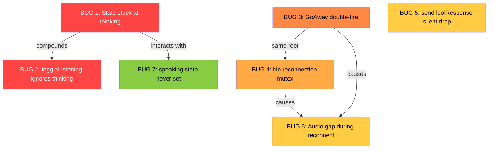
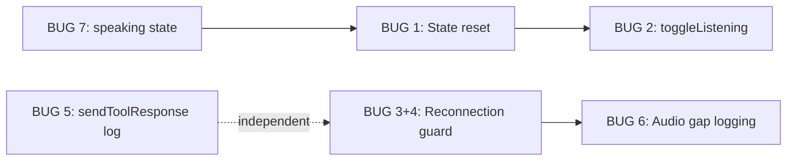

# JARVIS — Session State & Reconnection Bug Fixes

> **Analysis Date:** 2026-07-07
> **Files Affected:** `lib/providers/chat_provider.dart`, `lib/services/gemini_live_provider.dart`
> **Bugs Found:** 7 (2 CRITICAL/HIGH, 3 MEDIUM, 1 LOW)

---

## Bug Interaction Map



---

## 🔴 BUG 1 — Session State Stuck at `thinking` After Response

| Field | Detail |
|-------|--------|
| **File** | `lib/providers/chat_provider.dart` |
| **Severity** | 🔴 CRITICAL |
| **Lines** | 194-197, 271-289, 372-398 |

### Root Cause

`sendTextPrompt()` sets `sessionState` to `ChatSessionState.thinking` (line 282). When the model finishes, `_turnCompleteSub` fires and calls `_commitResponse()` (line 196), but **never resets the state**. The state remains `thinking` forever.

Additionally, `_commitResponse()` is a `void` method that fire-and-forgets `_playBufferedAudio()`. We need to know whether audio playback was triggered to make correct state decisions.

### Fix

**Step A:** Change `_commitResponse()` return type to `bool` (whether audio playback was triggered):

```dart
/// Commits the current streaming response to message history.
/// Returns true if audio playback was triggered.
bool _commitResponse() {
    final hasText = state.currentResponse.isNotEmpty;
    final hasAudio = _audioBuffer.isNotEmpty;

    _log.info('_commitResponse: hasText=$hasText hasAudio=$hasAudio '
        'textLen=${state.currentResponse.length} audioLen=${_audioBuffer.length}');

    if (hasText) {
      state = state.copyWith(
        messages: [
          ...state.messages,
          ChatMessage(
            text: state.currentResponse.trim(),
            isUser: false,
            timestamp: DateTime.now(),
          ),
        ],
        currentResponse: '',
      );
    }

    if (hasAudio) {
      _playBufferedAudio();
      return true;
    }
    return false;
}
```

**Step B:** Reset state in `_turnCompleteSub` (line 194-197):

```dart
_turnCompleteSub = llmProvider.turnCompleteStream.listen((_) {
  _log.info('Turn complete — committing response');
  final audioTriggered = _commitResponse();
  if (!audioTriggered) {
    state = state.copyWith(sessionState: ChatSessionState.listening);
  }
  // If audio was triggered, _playBufferedAudio() handles state → BUG 7
});
```

**Step C:** Also fix `stopListening()` to reset state properly when called during `thinking`:

```dart
Future<void> stopListening() async {
    // Allow stopping from listening, thinking, or speaking states
    if (state.sessionState != ChatSessionState.listening &&
        state.sessionState != ChatSessionState.thinking &&
        state.sessionState != ChatSessionState.speaking) return;
    _commitResponse();
    await _audioPipeline?.stopListening();
    final cleanedMessages = state.messages
        .where((m) => !(m.isSystem && m.text == 'Listening...'))
        .toList();
    state = state.copyWith(
      sessionState: ChatSessionState.idle,
      toolStatus: '',
      messages: cleanedMessages,
    );
}
```

> **⚠️ Interaction with BUG 7:** `_commitResponse()` returns `true` when audio plays, so `_turnCompleteSub` defers to `_playBufferedAudio()` for state transitions. Without BUG 7, the state would briefly flash to `listening` before `_playBufferedAudio()` sets `speaking`. Applying BUG 7 first is recommended.

---

## 🔴 BUG 2 — `toggleListening()` Ignores `thinking` and `speaking` States

| Field | Detail |
|-------|--------|
| **File** | `lib/providers/chat_provider.dart` |
| **Severity** | 🔴 HIGH |
| **Lines** | 292-301 |

### Root Cause

`toggleListening()` only handles `idle`, `error`, and `listening`. When state is `thinking` or `speaking`, the method is a no-op. Combined with BUG 1, this permanently locks the user out.

### Fix

```dart
Future<void> toggleListening() async {
    if (state.sessionState == ChatSessionState.idle ||
        state.sessionState == ChatSessionState.error) {
      _commitResponse();
      await startSession();
    } else if (state.sessionState == ChatSessionState.listening ||
               state.sessionState == ChatSessionState.thinking ||
               state.sessionState == ChatSessionState.speaking) {
      _commitResponse();
      await stopListening();
    }
    // connecting state: do nothing (let it finish)
}
```

> **Note:** `connecting` state is intentionally left as no-op — the connection is in progress and should complete naturally.

---

## 🟠 BUG 3+4 — Double Reconnection & No Mutual Exclusion

| Field | Detail |
|-------|--------|
| **File** | `lib/services/gemini_live_provider.dart` |
| **Severity** | 🟠 HIGH |
| **Lines** | 253-255, 169-173, 268-274, 278-289 |

### Root Cause

Two reconnection triggers race against each other:

1. **`GoAway` handler** (line 253): Calls `_handleStreamDone()` directly
2. **`onDone` callback** (line 172): Also fires when WebSocket closes after `GoAway`
3. **`connect()` catch block** (line 181): Calls `_handleReconnect()` on failure

With no mutual exclusion, two concurrent `connect()` calls compete, and the second call's `_cleanupPreviousSession()` destroys the session created by the first.

### Fix

Add a reconnection guard flag:

**Step A:** Add field to class (after line 35):

```dart
bool _isReconnecting = false;
```

**Step B:** Guard `_handleStreamDone()` (line 268):

```dart
void _handleStreamDone() {
    _log.info('Stream closed');
    _emitConnectionState(ConnectionState.disconnected);
    if (_retryCount < _maxRetries && !_isReconnecting) {
      _handleReconnect();
    }
}
```

**Step C:** Guard `_handleReconnect()` (line 278):

```dart
Future<void> _handleReconnect() async {
    if (_isReconnecting) {
      _log.info('Reconnection already in progress, skipping');
      return;
    }
    if (_cachedSystemInstruction == null || _cachedTools == null) return;

    _isReconnecting = true;
    try {
      final delay = _calculateBackoff(_retryCount);
      _retryCount++;
      _emitConnectionState(ConnectionState.connecting);
      _log.info('Reconnecting in ${delay.inSeconds}s (attempt $_retryCount/$_maxRetries)');
      await Future.delayed(delay);
      await connect(
        systemInstruction: _cachedSystemInstruction!,
        tools: _cachedTools!,
        config: _cachedConfig,
      );
    } finally {
      _isReconnecting = false;
    }
}
```

**Step D:** Also guard the `connect()` catch block (line 181):

```dart
} catch (e, stack) {
      _log.severe('Failed to connect to Gemini Live', e, stack);
      _emitConnectionState(ConnectionState.error);

      if (_retryCount < _maxRetries && !_isReconnecting) {
        await _handleReconnect();
      }
}
```

---

## 🟡 BUG 5 — `sendToolResponse` Silently Fails When Session Is Null

| Field | Detail |
|-------|--------|
| **File** | `lib/services/gemini_live_provider.dart` |
| **Severity** | 🟡 MEDIUM |
| **Lines** | 322-329 |

### Root Cause

When a tool call arrives during reconnection (`_session == null`), the response is silently dropped. The model waits indefinitely.

### Fix

```dart
@override
Future<void> sendToolResponse(List<FunctionResponse> responses) async {
    if (_session == null) {
      _log.warning('sendToolResponse called but session is null — '
          '${responses.length} response(s) dropped');
      return;
    }
    _session!.sendToolResponse(responses.map((r) => gai.FunctionResponse(
      id: r.id,
      name: r.name,
      response: r.result,
    )).toList());
}
```

---

## 🟡 BUG 6 — Audio Pipeline Gap During Reconnection

| Field | Detail |
|-------|--------|
| **Files** | `lib/services/gemini_live_provider.dart`, `lib/services/audio_pipeline.dart` |
| **Severity** | 🟡 MEDIUM |

### Root Cause

During reconnection, `connect()` calls `_cleanupPreviousSession()` which sets `_session = null`. Any audio frames arriving from the `AudioPipeline` during this window are silently dropped via `_session?.sendAudio()`.

The `AudioPipeline` itself remains viable — its `_audioSubscription` to the recorder stays active — so audio resumes flowing once the new session is established. The gap is proportional to reconnection latency (typically 1-5 seconds).

### Fix

This is partially mitigated by BUG 3+4 (faster, more reliable reconnection). For a more complete fix, log dropped audio frames during the reconnect window:

In `sendAudio()` (line 300):

```dart
@override
void sendAudio(List<int> pcmBytes) {
    _audioFramesSent++;
    if (_session == null) {
      // Log periodically, not every frame
      if (_audioFramesSent % 50 == 1) {
        _log.warning('sendAudio: $_audioFramesSent frames sent but session is null (reconnecting?)');
      }
      return;
    }
    if (_audioFramesSent % 50 == 1) {
      _log.info('sendAudio: #$_audioFramesSent, ${pcmBytes.length}B, session=${_session != null}');
    }
    _session!.sendAudio(pcmBytes);
}
```

> **Note:** Full audio buffering during reconnection is a more complex feature (requires queueing PCM frames and flushing on reconnect) and is deferred to a future iteration.

---

## 🟢 BUG 7 — `speaking` State Never Set

| Field | Detail |
|-------|--------|
| **File** | `lib/providers/chat_provider.dart` |
| **Severity** | 🟢 LOW |
| **Lines** | 404-425 |

### Root Cause

The `ChatSessionState.speaking` enum value exists and the UI handles it in `_ConnectionIndicator`, but no code ever sets it. `_playBufferedAudio()` plays TTS audio without updating state.

### Fix

```dart
Future<void> _playBufferedAudio() async {
    if (_audioBuffer.isEmpty) return;

    _log.info('Playing TTS audio: ${_audioBuffer.length} raw PCM bytes');

    // Signal that JARVIS is speaking
    state = state.copyWith(sessionState: ChatSessionState.speaking);

    try {
      final wavBytes = _pcmToWav(
        pcmData: Uint8List.fromList(_audioBuffer),
        sampleRate: _geminiSampleRate,
        bitsPerSample: _geminiBitsPerSample,
        channels: _geminiChannels,
      );

      await _audioPlayer.stop();
      await _audioPlayer.play(BytesSource(wavBytes));
      _log.info('Playing TTS audio (${_audioBuffer.length} PCM bytes → ${wavBytes.length} WAV bytes)');
    } catch (e) {
      _log.warning('Audio playback failed: $e');
    } finally {
      _audioBuffer.clear();
      // Return to listening state after playback completes
      // Only if we're still in speaking state (not interrupted)
      if (state.sessionState == ChatSessionState.speaking) {
        state = state.copyWith(sessionState: ChatSessionState.listening);
      }
    }
}
```

> **Key detail:** The `finally` block checks `if (state.sessionState == ChatSessionState.speaking)` before resetting to `listening`. This handles the barge-in case: if the user interrupts during playback, the `_interruptSub` listener (line 183-191) calls `_audioPlayer.stop()` and clears the buffer, but does NOT change `sessionState`. When `_playBufferedAudio()` resumes after `await _audioPlayer.play()` (which threw due to stop), the `finally` block won't override whatever state the interrupt handler set.

---

## 📋 Execution Order

```
BUG 3+4 → BUG 5 → BUG 7 → BUG 1 → BUG 2 → BUG 6
```

| Order | Bug | Rationale |
|-------|-----|-----------|
| 1st | BUG 3+4 | Foundation: stable reconnection prevents cascading failures |
| 2nd | BUG 5 | Independent one-liner; no dependencies |
| 3rd | BUG 7 | `speaking` state needed before BUG 1 so `_turnCompleteSub` can correctly defer to `_playBufferedAudio()` |
| 4th | BUG 1 | Depends on BUG 7's `_commitResponse()` return value + `speaking` transitions |
| 5th | BUG 2 | Depends on BUG 1 (won't get stuck at `thinking` anymore, but still needs the guard) |
| 6th | BUG 6 | Mostly mitigated by BUG 3+4; adds logging for remaining edge cases |

### Dependency Graph



---

## Files Changed Summary

| File | Bugs | Changes |
|------|------|---------|
| `lib/providers/chat_provider.dart` | BUG 1, BUG 2, BUG 7 | ~30 lines changed |
| `lib/services/gemini_live_provider.dart` | BUG 3, BUG 4, BUG 5, BUG 6 | ~25 lines changed |
| **Total** | **7 bugs** | **~55 lines across 2 files** |
