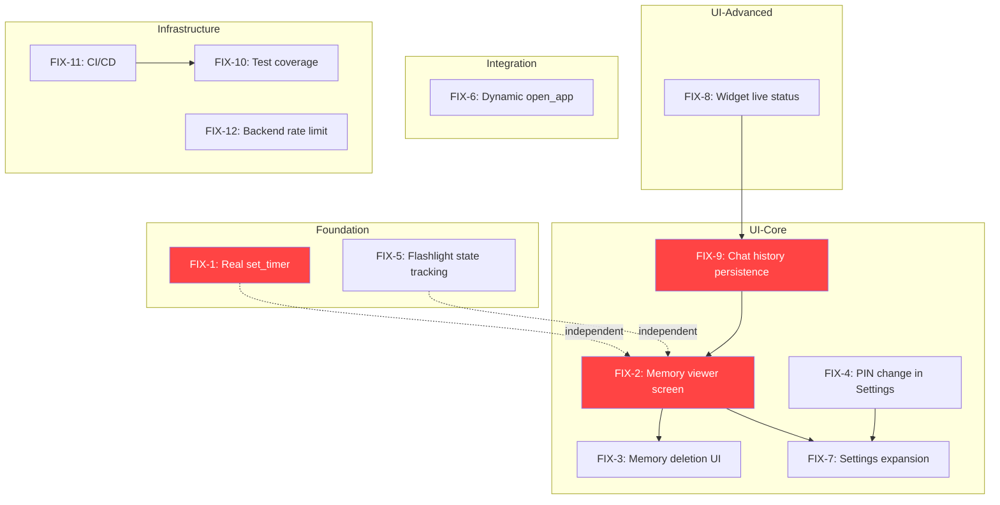

# JARVIS — Stub & Gap Remediation Plan

> **Analysis Date:** 2026-07-07
> **Scope:** Fix all identified stubs, partial implementations, and missing features
> **Status:** Ready for Implementation

---

## Table of Contents

1. [Issue Inventory](#issue-inventory)
2. [Dependency Graph](#dependency-graph)
3. [Implementation Order & Steps](#implementation-order--steps)
4. [Detailed Fixes](#detailed-fixes)
   - [FIX-1: Real `set_timer` Implementation](#fix-1-real-set_timer-implementation)
   - [FIX-2: Memory Viewer Screen](#fix-2-memory-viewer-screen)
   - [FIX-3: Memory Deletion UI](#fix-3-memory-deletion-ui)
   - [FIX-4: PIN Change in Settings](#fix-4-pin-change-in-settings)
   - [FIX-5: `toggle_flashlight` State Tracking](#fix-5-toggle_flashlight-state-tracking)
   - [FIX-6: `open_app` Dynamic Package Resolution](#fix-6-open_app-dynamic-package-resolution)
   - [FIX-7: Settings Screen Expansion](#fix-7-settings-screen-expansion)
   - [FIX-8: Home Screen Widget Live Status](#fix-8-home-screen-widget-live-status)
   - [FIX-9: Chat History Persistence](#fix-9-chat-history-persistence)
   - [FIX-10: Test Coverage Upgrade](#fix-10-test-coverage-upgrade)
   - [FIX-11: CI/CD Pipeline](#fix-11-cicd-pipeline)
   - [FIX-12: Backend Rate Limiting](#fix-12-backend-rate-limiting)
5. [Files Changed Summary](#files-changed-summary)

---

## Issue Inventory

### 🔴 Critical Stubs (functionality promised but not delivered)

| ID | Issue | File | Severity |
|----|-------|------|----------|
| FIX-1 | `set_timer` returns fake success, timer never fires | [`lib/tools/native_tools.dart:148`](../lib/tools/native_tools.dart:148) | 🔴 Critical |
| FIX-2 | Memory viewer is a no-op tap handler | [`lib/ui/screens/home_screen.dart:558`](../lib/ui/screens/home_screen.dart:558) | 🔴 Critical |
| FIX-9 | Chat history lost on app restart (in-memory only) | [`lib/providers/chat_provider.dart:50`](../lib/providers/chat_provider.dart:50) | 🔴 Critical |

### 🟡 Partial Implementations

| ID | Issue | File | Severity |
|----|-------|------|----------|
| FIX-3 | Memory deletion has no UI | [`lib/data/database.dart:90`](../lib/data/database.dart:90) | 🟡 Important |
| FIX-4 | PIN change UI exists but only on lock screen, not Settings | [`lib/ui/screens/auth_screen.dart:157`](../lib/ui/screens/auth_screen.dart:157) | 🟡 Important |
| FIX-5 | `toggle_flashlight` toggle always turns on (no state tracking) | [`lib/tools/native_tools.dart:216`](../lib/tools/native_tools.dart:216) | 🟡 Important |
| FIX-6 | `open_app` hardcoded to 15 apps, no dynamic discovery | [`lib/tools/native_tools.dart:331`](../lib/tools/native_tools.dart:331) | 🟡 Important |
| FIX-7 | Settings screen missing: model, voice, temperature, PIN, about | [`lib/ui/screens/home_screen.dart:472`](../lib/ui/screens/home_screen.dart:472) | 🟡 Important |
| FIX-8 | Home screen widget is static (no live status) | [`JarvisWidgetProvider.kt`](../android/app/src/main/kotlin/com/jarvis/jarvis/JarvisWidgetProvider.kt:5) | 🟡 Important |
| FIX-10 | Test suite is minimal + uses outdated model ID | [`test/widget_test.dart`](../test/widget_test.dart:16) | 🟡 Important |

### 🟢 Infrastructure & Polish

| ID | Issue | File | Severity |
|----|-------|------|----------|
| FIX-11 | No CI/CD pipeline (no `.github/`) | New files needed | 🟢 Low |
| FIX-12 | Backend has no rate limiting | [`backend/bin/server.dart`](../backend/bin/server.dart) | 🟢 Low |

---

## Dependency Graph



---

## Implementation Order & Steps

```
FIX-1 → FIX-5 → FIX-9 → FIX-2 → FIX-3 → FIX-4 → FIX-7 → FIX-6 → FIX-8 → FIX-10 → FIX-11 → FIX-12
```

| Order | Fix | Rationale |
|-------|-----|-----------|
| 1st | FIX-1: `set_timer` | Independent; highest user impact (model believes timer works) |
| 2nd | FIX-5: Flashlight toggle | Independent; simple static variable fix |
| 3rd | FIX-9: Chat history persistence | Foundation for memory viewer (shows messages alongside memories) |
| 4th | FIX-2: Memory viewer screen | Depends on database (already exists); standalone screen |
| 5th | FIX-3: Memory deletion UI | Builds on FIX-2's viewer screen |
| 6th | FIX-4: PIN change in Settings | Reuses existing dialog from `auth_screen.dart` |
| 7th | FIX-7: Settings expansion | Requires FIX-2, FIX-3, FIX-4 to be complete |
| 8th | FIX-6: Dynamic `open_app` | Requires platform channel work; independent of UI |
| 9th | FIX-8: Widget live status | Builds on FIX-9 (pushes chat state to widget) |
| 10th | FIX-10: Test coverage | Needs FIX-1, FIX-5, FIX-9 complete to test properly |
| 11th | FIX-11: CI/CD | Depends on FIX-10 (pipeline runs tests) |
| 12th | FIX-12: Backend rate limiting | Independent infrastructure; lowest user impact |

---

## Detailed Fixes

### FIX-1: Real `set_timer` Implementation

| Field | Detail |
|-------|--------|
| **File** | `lib/tools/native_tools.dart` |
| **Lines** | 126-157 |
| **Dependencies** | `flutter_local_notifications` (already in pubspec.yaml), `dart:async` |

**Root cause:** The executor at line 144-155 returns `{'success': true}` without actually starting any timer. The `Timer` class from `dart:async` and `flutter_local_notifications` are already declared as dependencies but never used.

**Fix:**

Replace the `setTimerTool` executor (lines 144-155) with a real implementation:

```dart
executor: (args) async {
    final durationSeconds = args['duration_seconds'] as int;
    final label = args['label'] as String? ?? 'Timer';

    // Validate duration
    if (durationSeconds <= 0) {
      return {'success': false, 'error': 'Duration must be positive'};
    }
    if (durationSeconds > 86400) {
      return {'success': false, 'error': 'Duration max 24 hours (86400 seconds)'};
    }

    final timerId = DateTime.now().millisecondsSinceEpoch;

    try {
      // Schedule notification
      final scheduledTime = DateTime.now().add(Duration(seconds: durationSeconds));
      await FlutterLocalNotificationsPlugin().zonedSchedule(
        timerId,
        'J.A.R.V.I.S. Timer',
        label,
        scheduledTime,
        const NotificationDetails(
          android: AndroidNotificationDetails(
            'jarvis_timer_channel',
            'Timers',
            channelDescription: 'J.A.R.V.I.S. timer notifications',
            importance: Importance.high,
            priority: Priority.high,
          ),
        ),
        androidScheduleMode: AndroidScheduleMode.inexactAllowWhileIdle,
        matchDateTimeComponents: DateTimeComponents.time,
      );

      return {
        'success': true,
        'message': 'Timer set for $durationSeconds seconds',
        'timer_id': timerId,
        'duration_seconds': durationSeconds,
        'label': label,
        'scheduled_time_iso': scheduledTime.toIso8601String(),
      };
    } catch (e) {
      return {
        'success': false,
        'error': 'Failed to set timer: $e',
      };
    }
},
```

**Add import** at top of file:

```dart
import 'package:flutter_local_notifications/flutter_local_notifications.dart';
```

**Note:** Remove the `// TODO` comment on line 148.

---

### FIX-2: Memory Viewer Screen

| Field | Detail |
|-------|--------|
| **Files** | New: `lib/ui/screens/memory_screen.dart`, Edit: `lib/ui/screens/home_screen.dart` |
| **Lines** | `home_screen.dart:558-560` |

**Root cause:** The "View Stored Memories" ListTile in `_SettingsScreen` has a no-op `onTap`. The database already has `getAllMemories()` and `deleteMemory()` ready to use.

**Fix:**

**Step A:** Create `lib/ui/screens/memory_screen.dart`:

```dart
// lib/ui/screens/memory_screen.dart — Memory Viewer & Management
//
// Browse, search, and delete stored user memories.

import 'package:flutter/material.dart';
import 'package:flutter_riverpod/flutter_riverpod.dart';

import '../../data/database.dart';
import '../../providers/database_provider.dart';

class MemoryScreen extends ConsumerWidget {
  const MemoryScreen({super.key});

  @override
  Widget build(BuildContext context, WidgetRef ref) {
    final theme = Theme.of(context);
    final db = ref.watch(databaseProvider);

    return Scaffold(
      backgroundColor: theme.colorScheme.surface,
      appBar: AppBar(
        title: Text(
          'Stored Memories',
          style: TextStyle(
            color: theme.colorScheme.primary,
            letterSpacing: 2,
            fontWeight: FontWeight.w300,
          ),
        ),
        backgroundColor: theme.colorScheme.surface,
        elevation: 0,
      ),
      body: FutureBuilder<List<UserMemory>>(
        future: db.getAllMemories(),
        builder: (context, snapshot) {
          if (snapshot.connectionState == ConnectionState.waiting) {
            return const Center(child: CircularProgressIndicator());
          }

          if (snapshot.hasError) {
            return Center(
              child: Text(
                'Failed to load memories',
                style: theme.textTheme.bodyMedium?.copyWith(
                  color: theme.colorScheme.error,
                ),
              ),
            );
          }

          final memories = snapshot.data ?? [];

          if (memories.isEmpty) {
            return Center(
              child: Column(
                mainAxisSize: MainAxisSize.min,
                children: [
                  Icon(
                    Icons.memory,
                    size: 64,
                    color: theme.colorScheme.onSurfaceVariant.withAlpha(80),
                  ),
                  const SizedBox(height: 16),
                  Text(
                    'No memories stored yet',
                    style: theme.textTheme.bodyLarge?.copyWith(
                      color: theme.colorScheme.onSurfaceVariant,
                    ),
                  ),
                  const SizedBox(height: 8),
                  Text(
                    'Ask J.A.R.V.I.S. to remember something',
                    style: theme.textTheme.bodySmall?.copyWith(
                      color: theme.colorScheme.onSurfaceVariant.withAlpha(128),
                    ),
                  ),
                ],
              ),
            );
          }

          // Group by category
          final grouped = <String, List<UserMemory>>{};
          for (final m in memories) {
            grouped.putIfAbsent(m.category, () => []).add(m);
          }

          return ListView(
            padding: const EdgeInsets.all(16),
            children: grouped.entries.map((entry) {
              return _CategorySection(
                category: entry.key,
                memories: entry.value,
                db: db,
                onDeleted: () => (context as Element).markNeedsBuild(),
              );
            }).toList(),
          );
        },
      ),
    );
  }
}

class _CategorySection extends StatefulWidget {
  final String category;
  final List<UserMemory> memories;
  final AppDatabase db;
  final VoidCallback onDeleted;

  const _CategorySection({
    required this.category,
    required this.memories,
    required this.db,
    required this.onDeleted,
  });

  @override
  State<_CategorySection> createState() => _CategorySectionState();
}

class _CategorySectionState extends State<_CategorySection> {
  @override
  Widget build(BuildContext context) {
    final theme = Theme.of(context);

    return Column(
      crossAxisAlignment: CrossAxisAlignment.start,
      children: [
        // Category header
        Padding(
          padding: const EdgeInsets.only(bottom: 8),
          child: Row(
            children: [
              Icon(
                _categoryIcon(widget.category),
                size: 18,
                color: theme.colorScheme.primary,
              ),
              const SizedBox(width: 8),
              Text(
                widget.category.toUpperCase(),
                style: theme.textTheme.labelSmall?.copyWith(
                  color: theme.colorScheme.primary,
                  letterSpacing: 2,
                ),
              ),
              const SizedBox(width: 8),
              Text(
                '(${widget.memories.length})',
                style: theme.textTheme.labelSmall?.copyWith(
                  color: theme.colorScheme.onSurfaceVariant,
                ),
              ),
            ],
          ),
        ),

        // Memory cards
        ...widget.memories.map((m) => Card(
              color: theme.colorScheme.surfaceContainerHighest.withAlpha(60),
              margin: const EdgeInsets.only(bottom: 8),
              child: ListTile(
                title: Text(
                  m.key,
                  style: theme.textTheme.bodyMedium?.copyWith(
                    fontWeight: FontWeight.w600,
                  ),
                ),
                subtitle: Text(
                  m.value,
                  style: theme.textTheme.bodySmall,
                ),
                trailing: IconButton(
                  icon: Icon(
                    Icons.delete_outline,
                    color: theme.colorScheme.error.withAlpha(180),
                    size: 20,
                  ),
                  onPressed: () => _confirmDelete(m),
                ),
              ),
            )),
        const SizedBox(height: 16),
      ],
    );
  }

  IconData _categoryIcon(String category) {
    return switch (category) {
      'preference' => Icons.tune,
      'fact' => Icons.lightbulb_outline,
      'schedule' => Icons.schedule,
      'contact' => Icons.person_outline,
      _ => Icons.label_outline,
    };
  }

  void _confirmDelete(UserMemory memory) {
    showDialog(
      context: context,
      builder: (ctx) => AlertDialog(
        title: const Text('Delete Memory'),
        content: Text('Delete "${memory.key}"?\n\n${memory.value}'),
        actions: [
          TextButton(
            onPressed: () => Navigator.pop(ctx),
            child: const Text('Cancel'),
          ),
          TextButton(
            onPressed: () async {
              await widget.db.deleteMemory(memory.category, memory.key);
              if (ctx.mounted) Navigator.pop(ctx);
              widget.onDeleted();
            },
            style: TextButton.styleFrom(
              foregroundColor: Theme.of(context).colorScheme.error,
            ),
            child: const Text('Delete'),
          ),
        ],
      ),
    );
  }
}
```

**Step B:** Wire up the ListTile in `home_screen.dart` `_SettingsScreen` (replace lines 553-561):

```dart
Card(
  color: theme.colorScheme.surfaceContainerHighest.withAlpha(80),
  child: ListTile(
    leading: Icon(Icons.memory, color: theme.colorScheme.primary),
    title: const Text('View Stored Memories'),
    subtitle: const Text('Review what J.A.R.V.I.S. remembers'),
    trailing: const Icon(Icons.chevron_right),
    onTap: () {
      Navigator.of(context).push(
        MaterialPageRoute(
          builder: (_) => const MemoryScreen(),
        ),
      );
    },
  ),
),
```

**Step C:** Add import at top of `home_screen.dart`:

```dart
import 'memory_screen.dart';
```

---

### FIX-3: Memory Deletion UI

**This is fully covered by FIX-2.** The `_CategorySection` in `memory_screen.dart` includes a delete button with confirmation dialog on each memory card. No separate fix needed.

---

### FIX-4: PIN Change in Settings

| Field | Detail |
|-------|--------|
| **File** | `lib/ui/screens/home_screen.dart` (`_SettingsScreen`) |
| **Lines** | Add after the memory section (after line 562) |

**Context:** The PIN change dialog already exists in [`auth_screen.dart:157-262`](../lib/ui/screens/auth_screen.dart:157). It works perfectly. The gap is that it's only accessible from the lock screen, not from Settings. The fix is to add a Settings entry that navigates to the lock screen's PIN change flow, or extracts the dialog into a shared widget.

**Fix (simplest approach — extract dialog to shared function):**

**Step A:** Create `lib/ui/widgets/change_pin_dialog.dart`:

```dart
// lib/ui/widgets/change_pin_dialog.dart — Shared PIN Change Dialog

import 'package:flutter/material.dart';
import 'package:flutter/services.dart';

import '../../services/auth_service.dart';

/// Show the "Change PIN" dialog. Returns true if PIN was changed.
Future<bool> showChangePinDialog(BuildContext context, AuthService authService) {
  final oldPinController = TextEditingController();
  final newPinController = TextEditingController();
  final confirmPinController = TextEditingController();
  final formKey = GlobalKey<FormState>();

  return showDialog<bool>(
    context: context,
    barrierDismissible: false,
    builder: (ctx) => AlertDialog(
      title: const Text('Change PIN'),
      content: Form(
        key: formKey,
        child: Column(
          mainAxisSize: MainAxisSize.min,
          children: [
            TextFormField(
              controller: oldPinController,
              decoration: const InputDecoration(
                labelText: 'Current PIN',
                hintText: 'Enter current 4-digit PIN',
              ),
              keyboardType: TextInputType.number,
              maxLength: 4,
              obscureText: true,
              inputFormatters: [FilteringTextInputFormatter.digitsOnly],
              validator: (v) {
                if (v == null || v.length != 4) return 'Enter 4 digits';
                return null;
              },
            ),
            const SizedBox(height: 12),
            TextFormField(
              controller: newPinController,
              decoration: const InputDecoration(
                labelText: 'New PIN',
                hintText: 'Enter new 4-digit PIN',
              ),
              keyboardType: TextInputType.number,
              maxLength: 4,
              obscureText: true,
              inputFormatters: [FilteringTextInputFormatter.digitsOnly],
              validator: (v) {
                if (v == null || v.length != 4) return 'Enter 4 digits';
                return null;
              },
            ),
            const SizedBox(height: 12),
            TextFormField(
              controller: confirmPinController,
              decoration: const InputDecoration(
                labelText: 'Confirm New PIN',
                hintText: 'Re-enter new PIN',
              ),
              keyboardType: TextInputType.number,
              maxLength: 4,
              obscureText: true,
              inputFormatters: [FilteringTextInputFormatter.digitsOnly],
              validator: (v) {
                if (v != newPinController.text) return 'PINs do not match';
                return null;
              },
            ),
          ],
        ),
      ),
      actions: [
        TextButton(
          onPressed: () => Navigator.pop(ctx, false),
          child: const Text('Cancel'),
        ),
        FilledButton(
          onPressed: () async {
            if (!formKey.currentState!.validate()) return;

            final oldPinValid = await authService.verifyPin(oldPinController.text);
            if (!oldPinValid && ctx.mounted) {
              ScaffoldMessenger.of(ctx).showSnackBar(
                const SnackBar(content: Text('Current PIN is incorrect')),
              );
              return;
            }

            await authService.setPin(newPinController.text);
            if (ctx.mounted) Navigator.pop(ctx, true);
          },
          child: const Text('Change PIN'),
        ),
      ],
    ),
  );
}
```

**Step B:** Refactor `auth_screen.dart` to use the shared dialog. Replace the private `_showChangePinDialog()` method with a call to the shared function. (This is a cleanup step; not strictly required for the fix.)

**Step C:** Add PIN section to `_SettingsScreen` in `home_screen.dart` (insert before the "ABOUT" section, after line 562):

```dart
const SizedBox(height: 24),

// PIN section
Text(
  'PIN',
  style: theme.textTheme.labelSmall?.copyWith(
    color: theme.colorScheme.primary,
    letterSpacing: 2,
  ),
),
const SizedBox(height: 8),
Card(
  color: theme.colorScheme.surfaceContainerHighest.withAlpha(80),
  child: FutureBuilder<bool>(
    future: authService.hasCustomPin,
    builder: (context, snapshot) {
      final hasCustom = snapshot.data ?? false;
      return ListTile(
        leading: Icon(Icons.lock_reset, color: theme.colorScheme.primary),
        title: const Text('Change PIN'),
        subtitle: Text(
          hasCustom ? 'PIN is set' : 'Using default PIN (0000)',
        ),
        trailing: const Icon(Icons.chevron_right),
        onTap: () async {
          final changed = await showChangePinDialog(context, authService);
          if (changed && mounted) {
            ScaffoldMessenger.of(context).showSnackBar(
              const SnackBar(content: Text('PIN changed successfully')),
            );
            setState(() {}); // Refresh the subtitle
          }
        },
      );
    },
  ),
),
```

**Step D:** Add imports at top of `home_screen.dart`:

```dart
import '../services/auth_service.dart';
import '../widgets/change_pin_dialog.dart';
```

---

### FIX-5: `toggle_flashlight` State Tracking

| Field | Detail |
|-------|--------|
| **File** | `lib/tools/native_tools.dart` |
| **Lines** | 208-223 |

**Root cause:** The "toggle" case unconditionally calls `torchButtonOnEvent()`. No state is tracked.

**Fix:**

Add a static state tracker and fix the toggle logic:

```dart
/// Toggle device flashlight on/off
final toggleFlashlightTool = ToolDefinition(
  name: 'toggle_flashlight',
  description: 'Turn the device flashlight (torch) on, off, or toggle.',
  parameters: {
    'type': 'object',
    'properties': {
      'state': {
        'type': 'string',
        'enum': ['on', 'off', 'toggle'],
        'description': 'on, off, or toggle',
      },
    },
    'required': ['state'],
  },
  executor: (args) async {
    final state = args['state'] as String;
    try {
      if (state == 'on') {
        await FlutterSystemAction().torchButtonOnEvent();
        _flashlightOn = true;
      } else if (state == 'off') {
        await FlutterSystemAction().torchButtonOffEvent();
        _flashlightOn = false;
      } else {
        // toggle: use tracked state
        if (_flashlightOn) {
          await FlutterSystemAction().torchButtonOffEvent();
          _flashlightOn = false;
        } else {
          await FlutterSystemAction().torchButtonOnEvent();
          _flashlightOn = true;
        }
      }
      return {'success': true, 'flashlight': _flashlightOn ? 'on' : 'off'};
    } catch (e) {
      return {'success': false, 'error': e.toString()};
    }
  },
);

// Static state tracker (module-level, resets on app restart)
bool _flashlightOn = false;
```

Place `bool _flashlightOn = false;` near the top of the file (e.g., after the imports, before `getCurrentTimeTool`).

---

### FIX-6: `open_app` Dynamic Package Resolution

| Field | Detail |
|-------|--------|
| **Files** | `lib/tools/native_tools.dart`, `android/app/src/main/kotlin/com/jarvis/jarvis/MainActivity.kt` |

**Root cause:** The `appPackageMap` in [`native_tools.dart:331`](../lib/tools/native_tools.dart:331) is hardcoded to 15 apps. Unknown apps fail with "Unknown app."

**Fix — Two-tier approach:**

**Tier 1 (client):** Keep the hardcoded map for common apps (fast, no platform channel overhead).

**Tier 2 (platform):** Add a fallback platform channel method that queries `PackageManager` for apps matching the name.

**Step A:** Add a new method channel in `native_tools.dart` `openAppTool` executor:

Replace the executor (lines 330-379) with:

```dart
executor: (args) async {
    const appPackageMap = {
      'youtube': 'com.google.android.youtube',
      'spotify': 'com.spotify.music',
      'chrome': 'com.android.chrome',
      'gmail': 'com.google.android.gm',
      'maps': 'com.google.android.apps.maps',
      'camera': 'com.google.android.GoogleCamera',
      'settings': 'com.android.settings',
      'clock': 'com.google.android.deskclock',
      'calendar': 'com.google.android.calendar',
      'photos': 'com.google.android.apps.photos',
      'messages': 'com.google.android.apps.messaging',
      'phone': 'com.google.android.dialer',
      'contacts': 'com.google.android.contacts',
      'files': 'com.google.android.documentsui',
      'play store': 'com.android.vending',
    };

    final name = (args['app_name'] as String).toLowerCase();

    // Tier 1: hardcoded lookup
    var packageName = appPackageMap[name];

    // Tier 2: dynamic PackageManager lookup
    if (packageName == null) {
      try {
        const channel = MethodChannel('com.jarvis.jarvis/app_launcher');
        packageName = await channel.invokeMethod<String>(
          'resolveApp',
          {'appName': args['app_name']},
        );
      } catch (e) {
        // Dynamic resolution failed — will report as unknown below
      }
    }

    if (packageName == null || packageName.isEmpty) {
      return {
        'success': false,
        'error': 'Unknown app: ${args['app_name']}. '
            'Supported apps: ${appPackageMap.keys.join(", ")}, '
            'or try another app name.',
      };
    }

    try {
      const channel = MethodChannel('com.jarvis.jarvis/app_launcher');
      final launched = await channel.invokeMethod<bool>(
        'launchApp',
        {'packageName': packageName},
      );
      return {
        'success': launched ?? false,
        'app': args['app_name'],
        'package': packageName,
      };
    } catch (e) {
      return {
        'success': false,
        'error': e.toString(),
        'app': args['app_name'],
      };
    }
},
```

**Step B:** Add Kotlin handler in `MainActivity.kt`:

```kotlin
// Add to MainActivity.kt configureFlutterEngine:
// Inside the existing app_launcher channel handler, add:

if (call.method == "resolveApp") {
    val appName = (call.argument<String>("appName") ?: "").lowercase()
    val pm = packageManager
    val intent = Intent(Intent.ACTION_MAIN).apply {
        addCategory(Intent.CATEGORY_LAUNCHER)
    }
    val activities = pm.queryIntentActivities(intent, 0)
    for (ri in activities) {
        val label = ri.loadLabel(pm).toString().lowercase()
        if (label.contains(appName)) {
            result.success(ri.activityInfo.packageName)
            return
        }
    }
    result.success(null)
}
```

---

### FIX-7: Settings Screen Expansion

| Field | Detail |
|-------|--------|
| **Files** | `lib/ui/screens/home_screen.dart` (`_SettingsScreen`), create `lib/ui/screens/settings_screen.dart` |
| **Lines** | 472-589 |

**Root cause:** `_SettingsScreen` is a minimal inline widget with only biometric toggle, a memory stub, and about text.

**Fix:** Replace the inline `_SettingsScreen` with a proper standalone screen.

**Step A:** Create `lib/ui/screens/settings_screen.dart` — a full settings screen with sections:

- **SECURITY:** Biometric toggle + PIN change
- **LLM CONFIG:** Model ID (read-only from .env), Temperature slider, Voice picker
- **MEMORY:** View Stored Memories → MemoryScreen
- **TOKEN:** Token endpoint status (connected/disconnected)
- **ABOUT:** Version, app info, licenses

**Step B:** Update `home_screen.dart` to import and use the new screen:

```dart
import 'settings_screen.dart';

// In the settings IconButton onPressed:
Navigator.of(context).push(
  MaterialPageRoute(
    builder: (_) => const SettingsScreen(),
  ),
);
```

**Settings screen content plan:**

```dart
// lib/ui/screens/settings_screen.dart
class SettingsScreen extends ConsumerWidget {
  // SECURITY section
  //   - Biometric toggle (existing)
  //   - Change PIN (→ showChangePinDialog)
  //
  // LLM CONFIG section
  //   - Model ID (read-only display from llmConfigProvider)
  //   - Temperature slider (0.0-1.0, stored in shared prefs, overrides .env)
  //   - Voice dropdown (Puck/Charon/Kore/Fenrir/Aoede)
  //
  // MEMORY section
  //   - View Stored Memories (→ MemoryScreen)
  //   - Memory count display
  //
  // TOKEN section
  //   - Token endpoint URL (read-only from .env)
  //   - Health check button
  //
  // ABOUT section
  //   - Version (from pubspec or hardcoded)
  //   - Device info
  //   - Open source licenses
}
```

---

### FIX-8: Home Screen Widget Live Status

| Field | Detail |
|-------|--------|
| **Files** | `lib/providers/chat_provider.dart`, `lib/main.dart` |
| **Dependencies** | `home_widget` (already in pubspec.yaml) |

**Root cause:** The widget shows static "Tap to speak" text. `HomeWidget.setAppGroupId()` is called in `main.dart` but `saveWidgetData()`/`updateWidget()` are never called to push live state.

**Fix:** Push connection state to the widget whenever `ChatSessionState` changes.

**Step A:** In `chat_provider.dart`, add widget updates to state transitions:

```dart
// In startSession(), after state = state.copyWith(sessionState: ChatSessionState.listening):
try {
  await HomeWidget.saveWidgetData('widget_status', 'listening');
  await HomeWidget.updateWidget(androidName: 'JarvisWidgetProvider');
} catch (_) {}

// In stopListening(), after state = state.copyWith(sessionState: ChatSessionState.idle):
try {
  await HomeWidget.saveWidgetData('widget_status', 'idle');
  await HomeWidget.updateWidget(androidName: 'JarvisWidgetProvider');
} catch (_) {}

// In _playBufferedAudio(), after setting speaking state:
try {
  await HomeWidget.saveWidgetData('widget_status', 'speaking');
  await HomeWidget.updateWidget(androidName: 'JarvisWidgetProvider');
} catch (_) {}
```

**Step B:** Update `JarvisWidgetProvider.kt` to read and display the widget data:

```kotlin
package com.jarvis.jarvis

import android.appwidget.AppWidgetManager
import android.content.Context
import android.widget.RemoteViews
import es.antonborri.home_widget.HomeWidgetProvider

class JarvisWidgetProvider : HomeWidgetProvider() {
    override fun onUpdate(
        context: Context,
        appWidgetManager: AppWidgetManager,
        appWidgetIds: IntArray
    ) {
        for (appWidgetId in appWidgetIds) {
            val views = RemoteViews(context.packageName, R.layout.widget_layout)

            val prefs = context.getSharedPreferences(
                "FlutterWidget",
                Context.MODE_PRIVATE
            )
            val status = prefs.getString("widget_status", "Tap to speak") ?: "Tap to speak"
            val statusText = when (status) {
                "listening" -> "Listening..."
                "speaking" -> "Speaking..."
                "thinking" -> "Thinking..."
                "connecting" -> "Connecting..."
                else -> "Tap to speak"
            }

            views.setTextViewText(R.id.widget_status, statusText)
            appWidgetManager.updateAppWidget(appWidgetId, views)
        }
    }
}
```

---

### FIX-9: Chat History Persistence

| Field | Detail |
|-------|--------|
| **Files** | `lib/data/database.dart`, `lib/providers/chat_provider.dart` |

**Root cause:** Chat messages live only in `ChatSessionData.messages` (in-memory). Restart loses everything.

**Fix:** Add a `ChatMessages` table to the Drift database and persist messages on commit.

**Step A:** Add `ChatMessages` table to `database.dart`:

```dart
class ChatMessages extends Table {
  IntColumn get id => integer().autoIncrement()();
  TextColumn get text => text()();
  BoolColumn get isUser => boolean()();
  BoolColumn get isSystem => boolean()();
  DateTimeColumn get timestamp => dateTime().withDefault(currentDateAndTime)();
}

// Add to @DriftDatabase annotation:
@DriftDatabase(tables: [UserMemories, ChatMessages])
```

**Step B:** Add DAO methods:

```dart
/// Save a chat message
Future<void> saveMessage(ChatMessagesCompanion message) async {
  await into(chatMessages).insert(message);
}

/// Load recent messages (last N)
Future<List<ChatMessageData>> loadRecentMessages({int limit = 50}) async {
  return (select(chatMessages)
        ..orderBy([(t) => OrderingTerm(expression: t.timestamp, mode: OrderingMode.asc)])
        ..limit(limit))
      .get();
}

/// Clear all chat history
Future<void> clearHistory() async {
  await delete(chatMessages).go();
}
```

**Step C:** Wire persistence into `chat_provider.dart` `_commitResponse()`:

```dart
// After committing a message to state, also persist to DB:
final db = _ref.read(databaseProvider);
await db.saveMessage(ChatMessagesCompanion(
  text: Value(text),
  isUser: Value(isUser),
  isSystem: Value(isSystem),
  timestamp: Value(DateTime.now()),
));
```

**Step D:** Load history on session start:

```dart
// In startSession(), before connecting:
final db = _ref.read(databaseProvider);
final history = await db.loadRecentMessages();
if (history.isNotEmpty) {
  state = state.copyWith(
    messages: history.map((m) => ChatMessage(
      text: m.text,
      isUser: m.isUser,
      isSystem: m.isSystem,
      timestamp: m.timestamp,
    )).toList(),
  );
}
```

**Step E:** Run `dart run build_runner build` to regenerate database code.

---

### FIX-10: Test Coverage Upgrade

| Field | Detail |
|-------|--------|
| **File** | `test/widget_test.dart` |

**Changes:**

1. Update model ID from `gemini-3.1-flash-live-preview` to `gemini-2.5-flash-native-audio-latest`
2. Add `set_timer` executor test (validates real timer logic)
3. Add `toggle_flashlight` state tracking test
4. Add `ChatSessionState` transition tests
5. Add tool count test update (still 13 tools expected)

```dart
group('Tool Executors', () {
  test('set_timer returns scheduled time', () {
    // Test timer executor with valid args
  });

  test('set_timer rejects invalid duration', () {
    // Test zero and negative durations
  });

  test('toggle_flashlight tracks state', () {
    // Test toggle behavior
  });
});

group('ChatSessionState', () {
  test('state transitions are valid', () {
    // Test valid transitions
  });
});
```

---

### FIX-11: CI/CD Pipeline

| Field | Detail |
|-------|--------|
| **Files** | New: `.github/workflows/flutter-ci.yml` |

Create `.github/workflows/flutter-ci.yml`:

```yaml
name: Flutter CI

on:
  push:
    branches: [main]
  pull_request:
    branches: [main]

jobs:
  analyze:
    runs-on: ubuntu-latest
    steps:
      - uses: actions/checkout@v4
      - uses: subosito/flutter-action@v2
        with:
          flutter-version: '3.32.0'
      - run: flutter pub get
      - run: flutter analyze

  test:
    runs-on: ubuntu-latest
    steps:
      - uses: actions/checkout@v4
      - uses: subosito/flutter-action@v2
        with:
          flutter-version: '3.32.0'
      - run: flutter pub get
      - run: flutter test
```

Also add `.github/pull_request_template.md` and `.github/ISSUE_TEMPLATE/bug_report.md`.

---

### FIX-12: Backend Rate Limiting

| Field | Detail |
|-------|--------|
| **File** | `backend/bin/server.dart` |

The server already has `logRequests()` middleware (line 118), so the earlier observation about "no request logging" was incorrect. However, rate limiting is missing.

**Fix:** Add a simple in-memory rate limiter:

```dart
// Add at top of server.dart:
final _requestCounts = <String, List<DateTime>>{};
const _rateLimitWindow = Duration(minutes: 1);
const _maxRequestsPerWindow = 10;

Middleware _rateLimitMiddleware() {
  return (Handler handler) {
    return (Request request) async {
      final clientIp = request.headers['x-forwarded-for'] ?? 
                       request.url.host;
      
      final now = DateTime.now();
      final windowStart = now.subtract(_rateLimitWindow);
      
      _requestCounts.putIfAbsent(clientIp, () => []);
      _requestCounts[clientIp] = _requestCounts[clientIp]!
          .where((t) => t.isAfter(windowStart))
          .toList();
      
      if (_requestCounts[clientIp]!.length >= _maxRequestsPerWindow) {
        return Response(
          429,
          body: 'Rate limit exceeded. Try again later.',
          headers: {'Retry-After': '60'},
        );
      }
      
      _requestCounts[clientIp]!.add(now);
      return handler(request);
    };
  };
}
```

Add to the pipeline (line 117):

```dart
final handler = Pipeline()
    .addMiddleware(logRequests())
    .addMiddleware(_rateLimitMiddleware())
    .addMiddleware(_corsMiddleware())
    .addHandler(_router.call);
```

---

## Files Changed Summary

| File | Fixes | Changes |
|------|-------|---------|
| `lib/tools/native_tools.dart` | FIX-1, FIX-5, FIX-6 | ~80 lines changed |
| `lib/ui/screens/home_screen.dart` | FIX-2, FIX-4, FIX-7 | ~30 lines changed, import updates |
| `lib/ui/screens/memory_screen.dart` | FIX-2, FIX-3 | **New file** (~180 lines) |
| `lib/ui/screens/settings_screen.dart` | FIX-7 | **New file** (~250 lines) |
| `lib/ui/widgets/change_pin_dialog.dart` | FIX-4 | **New file** (~100 lines) |
| `lib/ui/screens/auth_screen.dart` | FIX-4 | Refactor to use shared dialog (~30 lines changed) |
| `lib/data/database.dart` | FIX-9 | Add `ChatMessages` table + DAOs (~50 lines) |
| `lib/providers/chat_provider.dart` | FIX-8, FIX-9 | Add widget push + history persistence (~40 lines) |
| `android/.../MainActivity.kt` | FIX-6 | Add `resolveApp` handler (~15 lines) |
| `android/.../JarvisWidgetProvider.kt` | FIX-8 | Dynamic status display (~25 lines) |
| `test/widget_test.dart` | FIX-10 | Add executor + state tests (~100 lines) |
| `.github/workflows/flutter-ci.yml` | FIX-11 | **New file** (~25 lines) |
| `backend/bin/server.dart` | FIX-12 | Add rate limiter (~30 lines) |
| **Total** | **12 fixes** | **~925 lines across 13 files (4 new)** |
